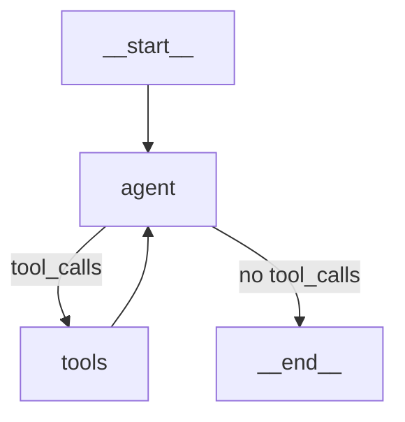

# FEAT-005 — LangGraph.js Expense Agent

> **Status:** 🔴 Not Started  
> **Execution Order:** 6 of 13  
> **Sprint:** 3 — AI Pipeline  
> **Blocked By:** FEAT-010, FEAT-006  
> **Priority:** P0 (Blocker)  
> **Estimate:** 2 days  
> **Assignee:** —

---

## Summary

Implement the LangGraph.js ReAct agent that extracts expense data from email text/HTML, categorizes it using a 4-tier strategy chain, and logs the transaction. The agent uses GPT-5.1 and has 4 tools: `extract_expense`, `lookup_categories`, `brave_search`, `log_expense`.

## User Stories

- **US-2:** "As a user, I want the AI to categorize my expenses with high certainty, using web search as a fallback when the vendor is ambiguous."

## Acceptance Criteria

- [ ] Agent compiles as a LangGraph.js graph with `createReactAgent()` pattern
- [ ] Agent state includes: `emailText`, `emailHtml`, `emailSubject`, `emailDate`, `userId`, `vendor`, `amount`, `categoryId`, `confidence`, `transactionId`
- [ ] Tool 1 (`extract_expense`): Extracts vendor, amount, date from email text via regex fast path
- [ ] Tool 2 (`lookup_categories`): Fetches user's categories from DB for LLM context
- [ ] Tool 3 (`brave_search`): Queries Smithery.ai Brave Search for unknown vendors
- [ ] Tool 4 (`log_expense`): Creates transaction in DB and updates vendor cache
- [ ] 4-tier categorization chain: Vendor Cache → LLM Match → Brave Search → Fallback "Other"
- [ ] Agent returns structured result: `{ transactionId, vendor, amount, categoryId, confidence }`
- [ ] Agent handles non-transaction emails gracefully (returns `null`)
- [ ] Agent timeout: 25 seconds max (leaves 5s buffer for webhook response)

## Technical Details

### Files to Create/Modify

| File | Purpose |
|------|---------|
| `src/lib/agent/graph.ts` | LangGraph.js agent definition |
| `src/lib/agent/state.ts` | Agent state Annotation schema |
| `src/lib/agent/tools/extract-expense.ts` | Email → structured data extraction |
| `src/lib/agent/tools/lookup-categories.ts` | Fetch user categories |
| `src/lib/agent/tools/brave-search.ts` | Smithery.ai Brave Search |
| `src/lib/agent/tools/log-expense.ts` | Write to DB + update cache |
| `src/lib/agent/prompts.ts` | System + user prompt templates |

### Agent Graph



### Tool Definitions

```typescript
// extract_expense
{
  name: "extract_expense",
  description: "Extract vendor name, amount, and date from email text/HTML",
  schema: z.object({
    emailText: z.string(),
    emailHtml: z.string().optional(),
    emailSubject: z.string(),
    emailDate: z.string(),
  })
}
```

### Design Patterns

- **Factory Pattern:** `AgentFactory.create(deps)` — [ADR-010](../ADR/ADR-010-factory-pattern.md)
- **Strategy Pattern:** `CategorizationChain` with 4 tiers — [ADR-013](../ADR/ADR-013-strategy-pattern.md)
- **DI Container:** Agent dependencies injected, testable with mocks — [ADR-007](../ADR/ADR-007-dependency-injection.md)

### Testing Approach

Per LangGraph.js test docs:
- `createGraph()` per test with `MemorySaver`
- `graph.nodes['node_name'].invoke()` for individual node testing
- `interruptBefore`/`interruptAfter` for partial execution

## Definition of Done

- [ ] Agent processes UOB, DBS, OCBC email fixtures correctly
- [ ] Agent returns `null` for non-transaction emails
- [ ] Unit tests: Email extraction (7 tests per `04-agent.test-plan.md`)
- [ ] Unit tests: Brave search tool (4 tests)
- [ ] Unit tests: Categorization chain (6 tests)
- [ ] Unit tests: Agent graph compilation + individual nodes (6 tests)
- [ ] Integration test: Webhook → Agent → Transaction created
- [ ] Agent handles API failures gracefully (OpenAI down, Brave down)
- [ ] No TypeScript errors

## References

- [AI_AGENT_ARCHITECTURE.md](../plans/AI_AGENT_ARCHITECTURE.md) — Full agent design
- [ADR-003](../ADR/ADR-003-langgraph-agent.md) — LangGraph.js decision
- [ADR-004](../ADR/ADR-004-brave-search-smithery.md) — Brave Search via Smithery
- [ADR-013](../ADR/ADR-013-strategy-pattern.md) — Categorization strategy chain
- [Testing Plan 04](../testing-plan/04-agent.test-plan.md) — Agent test plan (23 tests)
- Test fixtures: `email-samples.json`, `categories.json`, `vendor-cache.json`
