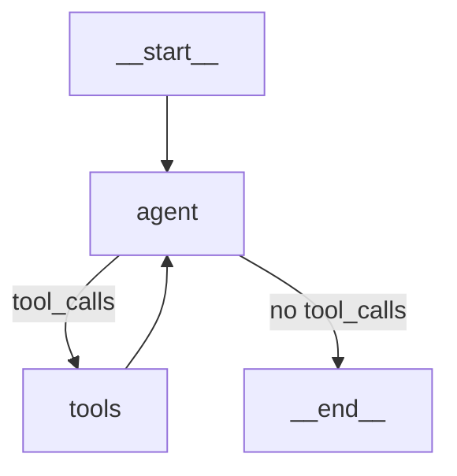

# FEAT-005 — LangGraph.js Expense Agent

> **Status:** 🟢 Done  
> **Execution Order:** 6 of 13  
> **Sprint:** 3 — AI Pipeline  
> **Blocked By:** FEAT-010, FEAT-006  
> **Priority:** P0 (Blocker)  
> **Estimate:** 2 days  
> **Assignee:** —

---

## Summary

Implement the LangGraph.js agent that extracts expense data from email text/HTML, categorizes it using a 5-tier strategy chain, and logs the transaction. The agent uses GPT-5.2 with a manual StateGraph pattern and has 5 tools: `extract_expense`, `lookup_categories`, `recall_memories`, `brave_search`, `log_expense`.

## User Stories

- **US-2:** "As a user, I want the AI to categorize my expenses with high certainty, using web search as a fallback when the vendor is ambiguous."

## Acceptance Criteria

- [x] Agent compiles as a LangGraph.js manual StateGraph with tool-calling loop
- [x] Agent state includes: `messages`, `emailText`, `emailHtml`, `emailSubject`, `emailDate`, `userId`, `vendor`, `amount`, `transactionDate`, `categoryId`, `categoryName`, `confidence`, `transactionId`
- [x] Tool 1 (`extract_expense`): Extracts vendor, amount, date from email text via regex fast path
- [x] Tool 2 (`lookup_categories`): Fetches user's categories from DB for LLM context
- [x] Tool 3 (`recall_memories`): Recalls user correction memories from Mem0 Cloud
- [x] Tool 4 (`brave_search`): Queries Smithery V2 Brave Search MCP for unknown vendors
- [x] Tool 5 (`log_expense`): Creates transaction in DB and updates vendor cache
- [x] 5-tier categorization chain: Vendor Cache → Mem0 Memory → LLM Match → Brave Search → Fallback "Other"
- [x] Agent returns structured result: `{ transactionId, vendor, amount, categoryId, confidence }`
- [x] Agent handles non-transaction emails gracefully (returns `null`)
- [x] Agent timeout: 25 seconds max (leaves 5s buffer for webhook response)

## Technical Details

### Files to Create/Modify

| File                                       | Purpose                               |
| ------------------------------------------ | ------------------------------------- |
| `src/lib/agent/graph.ts`                   | LangGraph.js StateGraph definition    |
| `src/lib/agent/state.ts`                   | Agent state Annotation schema         |
| `src/lib/agent/prompts.ts`                 | System + user prompt templates        |
| `src/lib/agent/tools/extract-expense.ts`   | Email → structured data (regex)       |
| `src/lib/agent/tools/lookup-categories.ts` | Fetch user categories (DI factory)    |
| `src/lib/agent/tools/recall-memories.ts`   | Mem0 Cloud memory recall (DI factory) |
| `src/lib/agent/tools/brave-search.ts`      | Smithery V2 Brave Search MCP          |
| `src/lib/agent/tools/log-expense.ts`       | Write to DB + update cache (DI)       |
| `src/lib/factories/tool.factory.ts`        | DI tool factory                       |
| `src/lib/agent/strategies/interfaces.ts`   | Strategy pattern interfaces           |
| `src/lib/agent/strategies/vendor-cache.strategy.ts` | Tier 1 — vendor cache lookup |
| `src/lib/agent/strategies/fallback-other.strategy.ts` | Tier 5 — fallback to Other |
| `src/lib/agent/strategies/categorization-chain.ts` | Strategy chain executor      |

### Agent Graph



### Tool Definitions

```typescript
// extract_expense
{
  name: "extract_expense",
  description: "Extract vendor name, amount, and date from email text/HTML",
  schema: z.object({
    emailText: z.string(),
    emailHtml: z.string().optional(),
    emailSubject: z.string(),
    emailDate: z.string(),
  })
}
```

### Design Patterns

- **Factory Pattern:** `AgentFactory.create(deps)` — [ADR-010](../ADR/ADR-010-factory-pattern.md)
- **Strategy Pattern:** `CategorizationChain` with 4 tiers — [ADR-013](../ADR/ADR-013-strategy-pattern.md)
- **DI Container:** Agent dependencies injected, testable with mocks — [ADR-007](../ADR/ADR-007-dependency-injection.md)

### Testing Approach

Per LangGraph.js test docs:

- `createGraph()` per test with `MemorySaver`
- `graph.nodes['node_name'].invoke()` for individual node testing
- `interruptBefore`/`interruptAfter` for partial execution

## Definition of Done

- [x] Agent processes UOB, DBS, OCBC email fixtures correctly
- [x] Agent returns `null` for non-transaction emails
- [x] Unit tests: Email extraction (7 tests per `04-agent.test-plan.md`)
- [x] Unit tests: Brave search tool (4 tests)
- [x] Unit tests: Categorization chain (7 tests)
- [x] Unit tests: Agent graph compilation + individual nodes (6 tests)
- [ ] Integration test: Webhook → Agent → Transaction created
- [x] Agent handles API failures gracefully (OpenAI down, Brave down)
- [x] No TypeScript errors

## References

- [AI_AGENT_ARCHITECTURE.md](../plans/AI_AGENT_ARCHITECTURE.md) — Full agent design
- [ADR-003](../ADR/ADR-003-langgraph-agent.md) — LangGraph.js decision
- [ADR-004](../ADR/ADR-004-brave-search-smithery.md) — Brave Search via Smithery
- [ADR-013](../ADR/ADR-013-strategy-pattern.md) — Categorization strategy chain
- [Testing Plan 04](../testing-plan/04-agent.test-plan.md) — Agent test plan (23 tests)
- Test fixtures: `email-samples.json`, `categories.json`, `vendor-cache.json`
