# Development Plan — Serial Execution Order

> **Project:** Aura Expense Agent  
> **Format:** JIRA-style sprint plan — work features top-to-bottom, one at a time  
> **Status Key:** 🔴 Not Started · 🟡 In Progress · 🟢 Done  
> **Estimated Total:** ~14.5 days

---

## How to Use This Plan

**Work the table top-to-bottom.** Each row's `Blocked By` column tells you what must be done first. Never start a feature whose blockers aren't 🟢. A coding agent should process rows sequentially — pick the first 🔴, complete it, mark it 🟢, move to the next.

---

## Execution Order

| #   | ID                                          | Feature                                  | Sprint | Blocked By                   | Est. | Status |
| --- | ------------------------------------------- | ---------------------------------------- | ------ | ---------------------------- | ---- | ------ |
| 1   | [FEAT-003](FEAT-003-project-scaffolding.md) | Project Scaffolding & Configuration      | 1      | —                            | 1d   | 🟢     |
| 2   | [FEAT-002](FEAT-002-database-setup.md)      | Appwrite Database Schema & Setup         | 1      | FEAT-003                     | 0.5d | 🟢     |
| 3   | [FEAT-001](FEAT-001-auth-oauth.md)          | OAuth Authentication (Google + GitHub)   | 1      | FEAT-003, FEAT-002           | 1d   | 🟡     |
| 4   | [FEAT-010](FEAT-010-category-management.md) | Category Management (CRUD)               | 2      | FEAT-001, FEAT-002           | 1d   | 🟢     |
| 5   | [FEAT-006](FEAT-006-vendor-cache.md)        | Vendor Cache (Agent Memory)              | 2      | FEAT-003, FEAT-002           | 0.5d | 🟢     |
| 6   | [FEAT-005](FEAT-005-ai-agent.md)            | LangGraph.js Expense Agent               | 3      | FEAT-010, FEAT-006           | 2d   | 🟢     |
| 7   | [FEAT-004](FEAT-004-webhook-handler.md)     | Resend Inbound Email Webhook Handler     | 3      | FEAT-005, FEAT-006           | 1.5d | 🟢     |
| 8   | [FEAT-008](FEAT-008-transactions-page.md)   | Transactions Page (Full CRUD)            | 4      | FEAT-001, FEAT-010, FEAT-006 | 1.5d | 🔴     |
| 9   | [FEAT-009](FEAT-009-budget-management.md)   | Budget Management & Salary Allocation    | 4      | FEAT-001, FEAT-010           | 1.5d | 🔴     |
| 10  | [FEAT-007](FEAT-007-dashboard.md)           | Dashboard with Charts & Alerts           | 4      | FEAT-008, FEAT-009, FEAT-010 | 2d   | 🔴     |
| 11  | [FEAT-013](FEAT-013-ai-feedback.md)         | AI Feedback & Correction Flow (Mem0)     | 5      | FEAT-008, FEAT-005, FEAT-006 | 2.5d | 🔴     |
| 12  | [FEAT-011](FEAT-011-testing-suite.md)       | Testing Suite (Unit + Integration + E2E) | 6      | All above                    | 2d   | 🔴     |
| 13  | [FEAT-012](FEAT-012-deployment.md)          | Vercel Deployment & CI/CD                | 6      | FEAT-011                     | 0.5d | 🔴     |

---

## Sprint Breakdown

### Sprint 1 — Foundation (2.5 days)

> **Goal:** Bootable app with auth, database, and project structure.

| #   | Feature                    | Why This Order                                                                                                                                                                |
| --- | -------------------------- | ----------------------------------------------------------------------------------------------------------------------------------------------------------------------------- |
| 1   | **FEAT-003 — Scaffolding** | Creates the project. Nothing else can exist without it. Next.js init, folder structure, DI skeleton, repo interfaces, service stubs, dev tooling.                             |
| 2   | **FEAT-002 — Database**    | Creates all 5 Appwrite collections. Needs the project to exist so `scripts/setup-appwrite.ts` and `src/lib/appwrite/config.ts` have a home.                                   |
| 3   | **FEAT-001 — Auth**        | Needs both the project (for pages, middleware) and the DB (for `users` table, category seeding on first login). After this, you have a working login → protected routes flow. |

**Milestone:** User can sign in with Google/GitHub, see a protected dashboard shell, and sign out.

---

### Sprint 2 — Data Layer (1.5 days)

> **Goal:** Category CRUD and vendor cache — the two data foundations everything else depends on.

| #   | Feature                     | Why This Order                                                                                                                                                                                                                           |
| --- | --------------------------- | ---------------------------------------------------------------------------------------------------------------------------------------------------------------------------------------------------------------------------------------- |
| 4   | **FEAT-010 — Categories**   | **Promoted from original Phase 3.** Categories are referenced by transactions, budgets, the AI agent (`lookup_categories` tool), and the dashboard. Building this early means every subsequent feature has real categories to work with. |
| 5   | **FEAT-006 — Vendor Cache** | The agent's first-tier strategy. Building `IVendorCacheRepository`, normalization utils, and `InMemory` test implementation now means the agent (FEAT-005) can use it immediately.                                                       |

**Milestone:** Category CRUD page works end-to-end. Vendor cache repo is implemented and unit-tested.

---

### Sprint 3 — AI Pipeline (3.5 days)

> **Goal:** The entire email → AI → transaction pipeline works.

| #   | Feature                        | Why This Order                                                                                                                                                                                          |
| --- | ------------------------------ | ------------------------------------------------------------------------------------------------------------------------------------------------------------------------------------------------------- |
| 6   | **FEAT-005 — AI Agent**        | Needs categories (for `lookup_categories` tool) and vendor cache (for `VendorCacheStrategy`). Builds the LangGraph.js graph, all 4 tools, the 4-tier categorization strategy chain, and `AgentFactory`. |
| 7   | **FEAT-004 — Webhook Handler** | The entry point that _calls_ the agent. Needs the agent to exist first. Wires dedup → cache fast-path → agent invocation → transaction creation.                                                        |

**Milestone:** Sending a test email to the Resend inbound address produces a categorized transaction in the DB.

---

### Sprint 4 — UI Pages (5 days)

> **Goal:** All user-facing pages with real data flowing through.

| #   | Feature                     | Why This Order                                                                                                                                                                          |
| --- | --------------------------- | --------------------------------------------------------------------------------------------------------------------------------------------------------------------------------------- |
| 8   | **FEAT-008 — Transactions** | Needs auth (protected page), categories (dropdown), vendor cache (autocomplete). Full CRUD: list, add, edit, re-categorize, delete. **Does NOT include AI feedback** — that's FEAT-013. |
| 9   | **FEAT-009 — Budgets**      | Needs auth and categories (per-category budgets). Both Direct Amount and Salary Allocation modes. Independent of transactions — can be built in parallel if desired.                    |
| 10  | **FEAT-007 — Dashboard**    | **Moved to last in Sprint 4.** Aggregates transactions, budgets, and categories. Building it after those three pages means the donut chart, progress bars, and alerts render real data. |

**Milestone:** All 4 main pages work: Categories, Transactions, Budgets, Dashboard.

---

### Sprint 5 — Intelligence Layer (2.5 days)

> **Goal:** AI learns from user corrections. Long-term memory via Mem0.

| #   | Feature                    | Why This Order                                                                                                                                                                                                                                                             |
| --- | -------------------------- | -------------------------------------------------------------------------------------------------------------------------------------------------------------------------------------------------------------------------------------------------------------------------- |
| 11  | **FEAT-013 — AI Feedback** | Needs the transactions page (feedback lives on transaction rows), the AI agent (processes feedback), and vendor cache (updated on approval). Introduces Mem0 client, `FeedbackService`, `Mem0MemoryStrategy`, and upgrades the categorization chain from 4-tier to 5-tier. |

**Milestone:** User can correct a miscategorized transaction via conversational feedback. Agent remembers corrections for future emails.

---

### Sprint 6 — Quality & Ship (2.5 days)

> **Goal:** Comprehensive test coverage, CI/CD pipeline, production deployment.

| #   | Feature                   | Why This Order                                                                                                                                                       |
| --- | ------------------------- | -------------------------------------------------------------------------------------------------------------------------------------------------------------------- |
| 12  | **FEAT-011 — Testing**    | Each feature's DoD already includes per-feature unit tests. This sprint fills integration gaps, adds E2E tests, and enforces coverage thresholds (~192 tests total). |
| 13  | **FEAT-012 — Deployment** | Needs passing tests. Vercel deploy, GitHub Actions CI/CD, production env vars, webhook URL configuration.                                                            |

**Milestone:** App is live on Vercel with CI/CD pipeline. All ~192 tests pass.

---

## Why This Order Differs From the Original

| Change                                                      | Reason                                                                                                                                                                           |
| ----------------------------------------------------------- | -------------------------------------------------------------------------------------------------------------------------------------------------------------------------------- |
| **FEAT-003 before FEAT-001 and FEAT-002**                   | Can't set up auth or DB without a project. The original had all three as "Phase 1" implying parallel work, but they're strictly sequential.                                      |
| **FEAT-010 promoted from Phase 3 → Sprint 2**               | Categories are a hard dependency for the agent, transactions, budgets, and dashboard. Leaving them in Phase 3 means Sprints 2–3 work against stubs.                              |
| **FEAT-006 before FEAT-005**                                | The agent's `VendorCacheStrategy` is the first tier of categorization. The repo must exist before the agent can use it.                                                          |
| **FEAT-005 before FEAT-004**                                | The webhook _calls_ the agent. Building the webhook first requires stubbing the entire agent interface — wasted effort.                                                          |
| **FEAT-007 moved from first in Phase 3 → last in Sprint 4** | Dashboard reads from transactions + budgets + categories. Building it first means testing against empty data and mocked services.                                                |
| **FEAT-013 isolated into Sprint 5**                         | AI feedback has deep dependencies (transactions page, agent, Mem0, vendor cache) and modifies the categorization chain. Isolating it prevents FEAT-008 from ballooning in scope. |

---

## Dependency Graph

```mermaid
graph TD
    F003[1. FEAT-003<br/>Scaffolding] --> F002[2. FEAT-002<br/>Database]
    F003 --> F001[3. FEAT-001<br/>Auth]
    F002 --> F001
    F001 --> F010[4. FEAT-010<br/>Categories]
    F002 --> F010
    F002 --> F006[5. FEAT-006<br/>Vendor Cache]
    F003 --> F006
    F010 --> F005[6. FEAT-005<br/>AI Agent]
    F006 --> F005
    F005 --> F004[7. FEAT-004<br/>Webhook]
    F006 --> F004
    F001 --> F008[8. FEAT-008<br/>Transactions]
    F010 --> F008
    F006 --> F008
    F001 --> F009[9. FEAT-009<br/>Budgets]
    F010 --> F009
    F008 --> F007[10. FEAT-007<br/>Dashboard]
    F009 --> F007
    F010 --> F007
    F008 --> F013[11. FEAT-013<br/>AI Feedback]
    F005 --> F013
    F006 --> F013
    F007 --> F011[12. FEAT-011<br/>Testing]
    F013 --> F011
    F004 --> F011
    F011 --> F012[13. FEAT-012<br/>Deployment]
```

