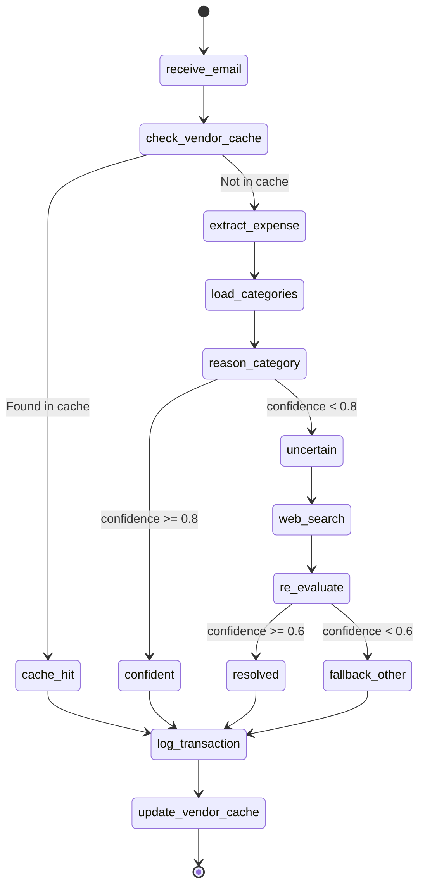

# Aura Expense Agent — AI Agent Architecture

> **Framework:** LangGraph.js + LangChain.js  
> **Model:** OpenAI GPT-5.2  
> **Pattern:** Manual StateGraph with tool-calling loop  
> **Memory:** Vendor Cache table (Appwrite) + Mem0 Cloud (feedback corrections)  
> **Fallback Search:** Brave Search via Smithery V2 API (`@smithery/api` + `@modelcontextprotocol/sdk`)

---

## 📋 Overview

The AI agent is the intelligence core of Aura. It receives raw email content and produces a structured, categorized expense record. The agent follows a **5-tier certainty escalation**:

```
Tier 1: Vendor Cache (instant, zero tokens)
  └─ MISS → Tier 2: Mem0 Memory Recall (check user corrections/preferences, ~200ms)
              └─ NO MATCH → Tier 3: Category Matching (LLM reasons over user's categories)
                            └─ LOW confidence → Tier 4: Web Search (Brave Search MCP)
                                                  └─ STILL unsure → Tier 5: Fallback to "Other"
```

**Design Principle:** Minimize LLM calls. The vendor cache short-circuits the entire agent for repeat vendors, Mem0 recalls user corrections for previously corrected vendors, and the category descriptions give the LLM rich context to match on the first try.

---

## 🏗️ Agent State Machine (LangGraph.js)



---

## 📦 LangGraph.js State Schema

```typescript
// src/lib/agent/state.ts

import { Annotation } from '@langchain/langgraph';

export const AgentState = Annotation.Root({
  // Input
  emailHtml: Annotation<string>, // Raw HTML from Resend
  emailText: Annotation<string>, // Plain text fallback
  emailSubject: Annotation<string>, // Email subject line
  emailDate: Annotation<string>, // ISO 8601 from Resend (UTC)
  resendEmailId: Annotation<string>, // For dedup
  userId: Annotation<string>, // Appwrite user ID

  // Extracted data
  vendor: Annotation<string | null>, // Parsed vendor name
  amount: Annotation<number | null>, // Parsed amount in SGD
  transactionDate: Annotation<string | null>, // Parsed date in SGT

  // Classification
  categoryId: Annotation<string | null>, // Resolved category ID
  categoryName: Annotation<string | null>, // For logging
  confidence: Annotation<'high' | 'medium' | 'low'>,

  // Context
  userCategories: Annotation<Array<{
    id: string;
    name: string;
    description: string;
  }> | null>,
  searchResults: Annotation<string | null>, // Brave Search results
  memoryContext: Annotation<string | null>, // Mem0 recalled memories
  cacheHit: Annotation<boolean>,

  // Output
  transactionId: Annotation<string | null>, // ID of created transaction
  error: Annotation<string | null>,
});

export type AgentStateType = typeof AgentState.State;
```

---

## 🔧 Agent Tools

### Tool 1: `extract_expense`

Parses raw email content into structured fields: `vendor`, `amount`, `transaction_date`.

```typescript
// src/lib/agent/tools/extract-expense.ts

import { tool } from '@langchain/core/tools';
import { z } from 'zod';

export const extractExpenseTool = tool(
  async ({ emailText, emailHtml, emailSubject, emailDate }) => {
    // The LLM itself does the extraction via function calling.
    // This tool provides the schema contract.
    // In practice, this is implemented as a structured output call.

    return {
      vendor: '', // LLM fills this
      amount: 0, // LLM fills this
      transactionDate: '', // LLM fills this
    };
  },
  {
    name: 'extract_expense',
    description: `Extract the vendor name, transaction amount (in SGD), and transaction date from a bank/merchant email. 
    
    RULES:
    - Amount: Extract the numeric value. Currency is always SGD.
    - Vendor: Extract the merchant/vendor name as it appears. Clean up common prefixes like "GRAB *", "SQ *", etc.
    - Date: Convert to ISO 8601 format in Singapore timezone (UTC+8). If the email only has a date like "08/02/26", interpret as DD/MM/YY (Singapore format).
    - If the email received date is provided as ISO 8601 (e.g., "2026-02-08T01:31:00+00:00"), convert to SGT by adding 8 hours.`,
    schema: z.object({
      emailText: z.string().describe('Plain text content of the email'),
      emailHtml: z.string().describe('HTML content of the email'),
      emailSubject: z.string().describe('Subject line of the email'),
      emailDate: z.string().describe('ISO 8601 date when email was received'),
    }),
  }
);
```

### Tool 2: `lookup_categories`

Fetches the user's categories (with descriptions) from Appwrite to give the LLM context.

```typescript
// src/lib/agent/tools/lookup-categories.ts

import { tool } from '@langchain/core/tools';
import { z } from 'zod';
import { getServerAppwrite } from '@/lib/appwrite/server';
import { Query } from 'node-appwrite';
import { APPWRITE_CONFIG } from '@/lib/appwrite/config';

export const lookupCategoriesTool = tool(
  async ({ userId }) => {
    const { databases } = getServerAppwrite();

    const result = await databases.listDocuments(
      APPWRITE_CONFIG.databaseId,
      APPWRITE_CONFIG.tables.categories,
      [Query.equal('user_id', userId)]
    );

    return result.documents.map((doc) => ({
      id: doc.$id,
      name: doc.name,
      description: doc.description,
    }));
  },
  {
    name: 'lookup_categories',
    description: `Fetch the user's expense categories from the database. Each category has a name and a description that explains what kind of expenses belong in it. Use these descriptions to determine the best category match for a vendor/expense.`,
    schema: z.object({
      userId: z.string().describe('The Appwrite user ID'),
    }),
  }
);
```

### Tool 3: `brave_search`

Web search fallback via Brave Search MCP Server on Smithery.ai registry. Only called when the agent can't confidently categorize a vendor.

**Smithery.ai MCP Integration:**

- **Registry URL:** `https://server.smithery.ai/brave`
- **Repository:** `brave/brave-search-mcp-server`
- **Tool:** `brave_web_search` — performs web searches with rich metadata (titles, descriptions, URLs)
- **Additional Tools Available:** `brave_image_search`, `brave_news_search`, `brave_video_search`, `brave_local_search`
- **Performance:** ~1.9s latency, 98.1% uptime
- **Auth:** Requires `BRAVE_SEARCH_API_KEY` passed via Smithery config

```typescript
// src/lib/agent/tools/brave-search.ts

import { tool } from '@langchain/core/tools';
import { z } from 'zod';

const SMITHERY_BRAVE_URL = 'https://server.smithery.ai/brave';

export const braveSearchTool = tool(
  async ({ query }) => {
    // Option A: Direct Brave Search API (simpler for V1)
    const response = await fetch(
      `https://api.search.brave.com/res/v1/web/search?q=${encodeURIComponent(query)}&count=5`,
      {
        headers: {
          Accept: 'application/json',
          'Accept-Encoding': 'gzip',
          'X-Subscription-Token': process.env.BRAVE_SEARCH_API_KEY!,
        },
      }
    );

    if (!response.ok) {
      return 'Search failed. Proceed with best guess.';
    }

    const data = await response.json();

    // Extract relevant snippets
    const results =
      data.web?.results
        ?.slice(0, 3)
        .map((r: any) => `${r.title}: ${r.description}`)
        .join('\n\n') || 'No results found.';

    return results;

    // Option B: MCP client via Smithery (for V2 when full MCP support is needed)
    // import { Client } from '@modelcontextprotocol/sdk/client';
    // const client = new Client({ url: SMITHERY_BRAVE_URL, config: { BRAVE_API_KEY: process.env.BRAVE_SEARCH_API_KEY } });
    // const result = await client.callTool('brave_web_search', { query, count: 3 });
    // return result;
  },
  {
    name: 'brave_search',
    description: `Search the web using Brave Search to find information about an unknown vendor or merchant. Use this ONLY when you cannot confidently categorize a vendor based on the email content and the user's category descriptions. 
    
    Example queries:
    - "What is DIGITALOCEAN.COM? What products or services do they sell?"
    - "What kind of business is CIRCLES.LIFE Singapore?"
    
    DO NOT use this for well-known vendors like McDonald's, Grab, Netflix, etc.`,
    schema: z.object({
      query: z.string().describe('Search query about the vendor'),
    }),
  }
);
```

### Tool 4: `recall_memories`

Queries Mem0 Cloud for user corrections and preferences related to a vendor. This is Tier 2 of the 5-tier categorization chain — checked after vendor cache miss but before LLM reasoning.

```typescript
// src/lib/agent/tools/recall-memories.ts

import { tool } from '@langchain/core/tools';
import { z } from 'zod';
import { getMem0Client } from '@/lib/mem0/client';

export const recallMemoriesTool = tool(
  async ({ userId, vendor }) => {
    const mem0 = getMem0Client();

    const memories = await mem0.search(`How should I categorize ${vendor}?`, {
      user_id: userId,
      limit: 3,
    });

    if (!memories.results?.length) {
      return 'No relevant memories found for this vendor.';
    }

    return memories.results.map((m: { memory: string }) => m.memory).join('\n');
  },
  {
    name: 'recall_memories',
    description: `Search the user's feedback memory (Mem0) for past corrections and preferences about a vendor or expense category. 
    
    Use this AFTER a vendor cache miss, BEFORE attempting to categorize with your own reasoning. If the user has previously corrected a categorization for this or a similar vendor, their preference should take priority.
    
    Example: If the user previously said "DigitalOcean should be in Bills category, not Shopping", this tool will recall that preference.`,
    schema: z.object({
      userId: z.string().describe('The Appwrite user ID'),
      vendor: z.string().describe('The vendor name to search memories for'),
    }),
  }
);
```

**Mem0 Client Singleton:**

```typescript
// src/lib/mem0/client.ts

import MemoryClient from 'mem0ai';

let mem0Instance: MemoryClient | null = null;

export function getMem0Client(): MemoryClient {
  if (!mem0Instance) {
    mem0Instance = new MemoryClient({
      apiKey: process.env.MEM0_API_KEY!,
    });
  }
  return mem0Instance;
}
```

### Tool 5: `log_expense`

Writes the final transaction to Appwrite and updates the vendor cache.

```typescript
// src/lib/agent/tools/log-expense.ts

import { tool } from '@langchain/core/tools';
import { z } from 'zod';
import { getServerAppwrite } from '@/lib/appwrite/server';
import { ID, Query } from 'node-appwrite';
import { APPWRITE_CONFIG } from '@/lib/appwrite/config';

export const logExpenseTool = tool(
  async ({
    userId,
    categoryId,
    amount,
    vendor,
    transactionDate,
    resendEmailId,
    emailSubject,
    confidence,
  }) => {
    const { databases } = getServerAppwrite();
    const { databaseId, tables } = APPWRITE_CONFIG;

    // 1. Create the transaction
    const transaction = await databases.createDocument(
      databaseId,
      tables.transactions,
      ID.unique(),
      {
        user_id: userId,
        category_id: categoryId,
        amount,
        vendor,
        description: '',
        transaction_date: transactionDate,
        resend_email_id: resendEmailId,
        raw_email_subject: emailSubject,
        confidence,
        source: 'email',
      }
    );

    // 2. Update or create vendor cache entry
    const normalizedVendor = vendor.toUpperCase().trim();
    const existingCache = await databases.listDocuments(databaseId, tables.vendorCache, [
      Query.equal('user_id', userId),
      Query.equal('vendor_name', normalizedVendor),
    ]);

    if (existingCache.total > 0) {
      // Update hit count
      await databases.updateDocument(
        databaseId,
        tables.vendorCache,
        existingCache.documents[0].$id,
        { hit_count: existingCache.documents[0].hit_count + 1 }
      );
    } else {
      // Create new cache entry
      await databases.createDocument(databaseId, tables.vendorCache, ID.unique(), {
        user_id: userId,
        vendor_name: normalizedVendor,
        category_id: categoryId,
        hit_count: 1,
      });
    }

    return {
      transactionId: transaction.$id,
      status: 'success',
    };
  },
  {
    name: 'log_expense',
    description: `Log the extracted and categorized expense to the database and update the vendor cache for future lookups.`,
    schema: z.object({
      userId: z.string(),
      categoryId: z.string().describe('The ID of the matched category'),
      amount: z.number().describe('Transaction amount in SGD'),
      vendor: z.string().describe('Merchant/vendor name'),
      transactionDate: z.string().describe('ISO 8601 date in SGT'),
      resendEmailId: z.string().describe('Resend email ID for dedup'),
      emailSubject: z.string().describe('Original email subject'),
      confidence: z.enum(['high', 'medium', 'low']),
    }),
  }
);
```

---

## 🧠 System Prompt

```typescript
// src/lib/agent/prompts.ts

export const SYSTEM_PROMPT = `You are the Aura Financial Extraction Agent. Your job is to process incoming bank/merchant emails and extract structured expense data.

## Your Workflow
1. EXTRACT: Parse the email to find the transaction amount (SGD), vendor name, and transaction date.
2. RECALL: Check Mem0 memory for any user corrections or preferences about this vendor.
3. CATEGORIZE: Using the user's categories (with descriptions) and any recalled memories, determine the best category match.
4. SEARCH (only if needed): If you cannot confidently categorize the vendor, use web search to learn about the vendor.
5. LOG: Write the categorized transaction to the database.

## Rules
- Currency is ALWAYS SGD. Extract the numeric value only.
- Dates in emails from Singapore are DD/MM/YY format. Convert to ISO 8601 with +08:00 timezone.
- If the email provides a UTC timestamp, convert to Singapore Time (UTC+8).
- Vendor names: Clean up common prefixes (e.g., "GRAB *GRABFOOD" → "Grab GrabFood", "SQ *" → remove prefix).
- Category matching: Read each category's description carefully. Match based on the DESCRIPTION, not just the category name.
- **Memory takes priority**: If recall_memories returns a user correction, ALWAYS follow the user's preference over your own reasoning.
- Confidence levels:
  - "high": The vendor clearly matches a category (e.g., Netflix → Entertainment)
  - "medium": You needed web search but found a clear answer
  - "low": Even after search, you're not fully sure. Default to "Other".
- NEVER invent categories. Only use the categories provided by lookup_categories.
- NEVER guess amounts. If you can't parse the amount, report an error.

## Email Format Examples
Bank alert: "A transaction of SGD 16.23 was made with your UOB Card ending 8909 on 08/02/26 at DIGITALOCEAN.COM."
Merchant receipt: Rich HTML with order details, line items, totals.

Extract the TOTAL amount from the email, not individual line items.`;

export const buildUserPrompt = (emailContent: string, emailSubject: string) => `
Process this email and extract, categorize, and log the expense:

**Subject:** ${emailSubject}

**Email Content:**
${emailContent}
`;
```

---

## 🔄 LangGraph.js Graph Definition

```typescript
// src/lib/agent/graph.ts

import { StateGraph } from '@langchain/langgraph';
import { ChatOpenAI } from '@langchain/openai';
import { ToolNode } from '@langchain/langgraph/prebuilt';
import { AgentState, type AgentStateType } from './state';
import { extractExpenseTool } from '@/lib/agent/tools/extract-expense';
import { lookupCategoriesTool } from '@/lib/agent/tools/lookup-categories';
import { recallMemoriesTool } from '@/lib/agent/tools/recall-memories';
import { braveSearchTool } from '@/lib/agent/tools/brave-search';
import { logExpenseTool } from '@/lib/agent/tools/log-expense';
import { SYSTEM_PROMPT, buildUserPrompt } from './prompts';
import { HumanMessage, SystemMessage } from '@langchain/core/messages';

// Initialize the model with all tools bound
const tools = [
  extractExpenseTool,
  lookupCategoriesTool,
  recallMemoriesTool,
  braveSearchTool,
  logExpenseTool,
];
const model = new ChatOpenAI({
  model: 'gpt-5.1',
  temperature: 0,
}).bindTools(tools);

const toolNode = new ToolNode(tools);

// --- Node Definitions ---

async function agentNode(state: AgentStateType) {
  const emailContent = state.emailText || state.emailHtml || '';

  const messages = [
    new SystemMessage(SYSTEM_PROMPT),
    new HumanMessage(buildUserPrompt(emailContent, state.emailSubject)),
  ];

  const response = await model.invoke(messages);
  return { messages: [response] };
}

function shouldContinue(state: AgentStateType) {
  const lastMessage = state.messages[state.messages.length - 1];

  // If the LLM wants to call tools, route to tool node
  if (lastMessage.tool_calls?.length > 0) {
    return 'tools';
  }

  // Otherwise, we're done
  return 'end';
}

// --- Graph Construction ---

export function createExpenseAgent() {
  const graph = new StateGraph(AgentState)
    .addNode('agent', agentNode)
    .addNode('tools', toolNode)
    .addEdge('__start__', 'agent')
    .addConditionalEdges('agent', shouldContinue, {
      tools: 'tools',
      end: '__end__',
    })
    .addEdge('tools', 'agent');

  return graph.compile();
}

// --- Entry Point ---

export async function processExpenseEmail(params: {
  emailHtml: string;
  emailText: string;
  emailSubject: string;
  emailDate: string;
  resendEmailId: string;
  userId: string;
}) {
  const agent = createExpenseAgent();

  const result = await agent.invoke({
    emailHtml: params.emailHtml,
    emailText: params.emailText,
    emailSubject: params.emailSubject,
    emailDate: params.emailDate,
    resendEmailId: params.resendEmailId,
    userId: params.userId,
    vendor: null,
    amount: null,
    transactionDate: null,
    categoryId: null,
    categoryName: null,
    confidence: 'low',
    userCategories: null,
    searchResults: null,
    cacheHit: false,
    transactionId: null,
    error: null,
  });

  return result;
}
```

---

## ⚡ Vendor Cache Fast Path

The vendor cache check happens **before** the LangGraph agent is invoked, inside the webhook handler. This avoids spinning up the agent entirely for known vendors.

```typescript
// Pseudocode in /api/webhooks/resend/route.ts

// 1. Extract a rough vendor name using simple regex (no LLM)
const vendorMatch = emailText.match(/at\s+([A-Z0-9\s.*]+?)[\.\s]*(?:If|$)/i);
const roughVendor = vendorMatch?.[1]?.toUpperCase().trim();

if (roughVendor) {
  // 2. Check vendor cache
  const cached = await checkVendorCache(userId, roughVendor);

  if (cached) {
    // 3. Fast path: skip agent, log directly
    await logTransaction({
      userId,
      categoryId: cached.categoryId,
      amount: parseAmountFromEmail(emailText), // simple regex
      vendor: roughVendor,
      transactionDate: parseDateFromEmail(emailText, emailDate),
      resendEmailId,
      confidence: 'high',
    });

    // 4. Increment cache hit count
    await incrementCacheHitCount(cached.id);

    return NextResponse.json({ status: 'cached' });
  }
}

// 5. Cache miss: invoke the full LangGraph agent
const result = await processExpenseEmail({ ... });
```

---

## 🔍 Brave Search via Smithery.ai MCP Integration

The Brave Search tool leverages the **Smithery.ai MCP registry** (`https://server.smithery.ai/brave`) — maintained as an MCP server by the `brave/brave-search-mcp-server` repository.

**Available MCP Tools:**
| Tool | Description | Used in V1 |
|------|-------------|-----------|
| `brave_web_search` | Web search with titles, descriptions, URLs, rich metadata | ✅ |
| `brave_local_search` | Location-based search (businesses, POIs) | ❌ (V2) |
| `brave_news_search` | Breaking news search | ❌ |
| `brave_image_search` | Image search | ❌ |
| `brave_video_search` | Video search | ❌ |

**V1 Approach:** Direct Brave Search REST API call (simpler, no MCP client SDK needed).  
**V2 Approach:** Full MCP client via `@modelcontextprotocol/sdk` connecting to `https://server.smithery.ai/brave`.

**When the agent calls `brave_search`:**

1. It constructs a query like: `"What is DIGITALOCEAN.COM? What products or services do they sell?"`
2. Brave returns the top 3 web results with titles and descriptions
3. The agent re-evaluates its category choice with the new context
4. If it now has a match → `confidence: "medium"`, else → `confidence: "low"` + category `"Other"`

**Cost:**

- Brave Search API: 2,000 free queries/month
- Expected usage: < 50 queries/month (only for unknown vendors, first-time only due to caching)
- After cache warm-up, Brave Search calls drop to near-zero

---

## 🔄 Agent Invocation Flow (Detailed)

```
┌─────────────────────────────────────────────────────────────────┐
│  POST /api/webhooks/resend                                       │
│                                                                   │
│  1. Verify webhook signature                                      │
│  2. Fetch full email via Resend API                               │
│  3. Resolve user from inbound_email → userId                     │
│  4. Dedup check: resend_email_id exists in transactions?         │
│     ├─ YES → return 200 (skip)                                    │
│     └─ NO → continue                                              │
│  5. Quick vendor extraction (regex)                               │
│  6. Vendor cache check                                            │
│     ├─ HIT → log_transaction directly → return 200               │
│     └─ MISS → invoke LangGraph agent ↓                           │
│                                                                   │
│  ┌───────────────────────────────────────────────────────────┐   │
│  │  LangGraph Agent                                           │   │
│  │                                                             │   │
│  │  Step 1: agent calls extract_expense tool                   │   │
│  │    → LLM parses email → {vendor, amount, date}             │   │
│  │                                                             │   │
│  │  Step 2: agent calls lookup_categories tool                 │   │
│  │    → Fetches user's categories + descriptions               │   │
│  │                                                             │   │
│  │  Step 3: agent reasons about category match                 │   │
│  │    ├─ Confident → calls log_expense tool → DONE             │   │
│  │    └─ Not confident → calls brave_search tool               │   │
│  │                                                             │   │
│  │  Step 4 (if needed): agent re-evaluates with search context │   │
│  │    ├─ Now confident → calls log_expense → DONE              │   │
│  │    └─ Still unsure → assigns "Other" → log_expense → DONE  │   │
│  └───────────────────────────────────────────────────────────┘   │
│                                                                   │
│  7. Return 200 OK                                                 │
└─────────────────────────────────────────────────────────────────┘
```

---

## 📊 Token & Cost Estimation

| Scenario                          | Input Tokens | Output Tokens | Cost (GPT-4o) | Frequency                    |
| --------------------------------- | ------------ | ------------- | ------------- | ---------------------------- |
| Cache HIT                         | 0            | 0             | $0.00         | ~70% of emails after warm-up |
| Simple categorization (no search) | ~1,500       | ~200          | ~$0.005       | ~25%                         |
| Web search fallback               | ~3,000       | ~400          | ~$0.012       | ~5%                          |

**Estimated monthly cost at 100 transactions:**

- 70 cache hits: $0.00
- 25 simple: $0.125
- 5 with search: $0.06
- **Total: ~$0.19/month** (excluding Brave Search free tier)

---

## ⚠️ Error Handling

| Error                        | Handling                                                                                             |
| ---------------------------- | ---------------------------------------------------------------------------------------------------- |
| LLM can't parse amount       | Agent returns error → webhook logs raw email for manual review                                       |
| LLM timeout                  | 30s timeout on agent invocation → retry once → if still fails, log as "pending review"               |
| Brave Search API down        | Agent skips search, assigns "Other" with `confidence: "low"`                                         |
| Appwrite DB write fails      | Retry with exponential backoff (3 attempts) → if still fails, return 500 (Resend will retry webhook) |
| Duplicate vendor cache entry | Caught by unique index → upsert pattern (update hit count)                                           |
| Mem0 API down                | Skip memory recall, proceed to Tier 3 (LLM category matching). Feedback storage queued for retry.    |

---

## 🔄 Feedback Processing Pipeline

When a user corrects a categorization via the feedback sheet (see [FEAT-013](../features/FEAT-013-ai-feedback.md)), the system processes the correction through a conversational flow and stores the result in Mem0 for future recall.

### Feedback Flow

```
User clicks "Give AI Feedback" on transaction detail sheet
  │
  ▼
POST /api/feedback { transactionId, feedbackText }
  │
  ▼
FeedbackService.processFeedback()
  │
  ├── 1. Load transaction + current category + user categories
  ├── 2. Call LLM with feedback context:
  │      "User says: '{feedbackText}' about {vendor} currently in {category}"
  │      → LLM proposes { newCategoryId, reasoning }
  ├── 3. Return proposal to frontend
  │
  ▼
User sees: "I'll recategorize {vendor} as {newCategory} because: {reasoning}"
  ├── [Approve] → FeedbackService.approveFeedback()
  │     ├── Update transaction.category_id
  │     ├── Update vendor_cache
  │     └── Store memory in Mem0:
  │           mem0.add("User prefers {vendor} in {category}: {reasoning}", { user_id })
  │
  └── [Reject & Refine] → User provides more feedback (max 3 rounds)
        └── Loop back to FeedbackService.processFeedback()
```

### FeedbackService

```typescript
// src/lib/services/feedback.service.ts

import { ChatOpenAI } from '@langchain/openai';
import { getMem0Client } from '@/lib/mem0/client';
import { getServerAppwrite } from '@/lib/appwrite/server';
import { APPWRITE_CONFIG } from '@/lib/appwrite/config';

const model = new ChatOpenAI({ model: 'gpt-5.1', temperature: 0 });

export class FeedbackService {
  async processFeedback(params: {
    transactionId: string;
    userId: string;
    feedbackText: string;
    conversationHistory?: Array<{ role: string; content: string }>;
  }) {
    const { databases } = getServerAppwrite();
    const { databaseId, tables } = APPWRITE_CONFIG;

    // 1. Load transaction
    const transaction = await databases.getDocument(
      databaseId,
      tables.transactions,
      params.transactionId
    );

    // 2. Load user categories
    const categories = await databases.listDocuments(databaseId, tables.categories, [
      Query.equal('user_id', params.userId),
    ]);

    // 3. Ask LLM to propose re-categorization
    const response = await model.invoke([
      { role: 'system', content: FEEDBACK_SYSTEM_PROMPT },
      {
        role: 'user',
        content: `
        Transaction: ${transaction.vendor} — SGD ${transaction.amount}
        Current category: ${transaction.category_id}
        Available categories: ${JSON.stringify(categories.documents.map((c) => ({ id: c.$id, name: c.name, description: c.description })))}
        User feedback: "${params.feedbackText}"
      `,
      },
      ...(params.conversationHistory || []),
    ]);

    return {
      proposedCategoryId: response.categoryId,
      proposedCategoryName: response.categoryName,
      reasoning: response.reasoning,
    };
  }

  async approveFeedback(params: {
    transactionId: string;
    userId: string;
    newCategoryId: string;
    vendor: string;
    reasoning: string;
  }) {
    const { databases } = getServerAppwrite();
    const { databaseId, tables } = APPWRITE_CONFIG;
    const mem0 = getMem0Client();

    // 1. Update transaction
    await databases.updateDocument(databaseId, tables.transactions, params.transactionId, {
      category_id: params.newCategoryId,
    });

    // 2. Update vendor cache
    const normalizedVendor = params.vendor.toUpperCase().trim();
    // ... upsert vendor_cache with new category

    // 3. Store in Mem0 for future recall
    await mem0.add(
      `User prefers "${params.vendor}" to be categorized as "${params.newCategoryId}". Reason: ${params.reasoning}`,
      { user_id: params.userId }
    );
  }
}
```

**Memory Impact on Future Categorizations:**

After a user corrects "DIGITALOCEAN.COM" from "Shopping" to "Bills & Utilities":

1. **Vendor Cache** is updated → next DigitalOcean charge hits cache (Tier 1)
2. **Mem0** stores the preference → if vendor cache is cold (e.g., after "DIGITAL OCEAN" variant), Mem0 recall (Tier 2) catches similar vendors
3. The 5-tier chain ensures corrections "stick" across both exact matches and fuzzy/semantic matches
