# Aura Expense Agent — Database Schema

> **Backend:** Appwrite Cloud (MariaDB under the hood)  
> **API:** TablesDB (`node-appwrite@22`) — use named parameter objects, not positional args  
> **Terminology:** Appwrite uses "Database → Tables → Rows → Columns"  
> **Currency:** SGD only (V1)  
> **Timezone:** Asia/Singapore (UTC+8)  
> **Note:** Code examples below may use the older `Databases` API style. See `AGENTS.md` for current API usage.

---

## 📊 Entity Relationship Diagram

```mermaid
erDiagram
    USERS ||--o{ TRANSACTIONS : "has many"
    USERS ||--o{ CATEGORIES : "has many"
    USERS ||--o{ BUDGETS : "has many"
    USERS ||--o{ VENDOR_CACHE : "has many"
    CATEGORIES ||--o{ TRANSACTIONS : "categorizes"
    CATEGORIES ||--o{ BUDGETS : "has budget"
    CATEGORIES ||--o{ VENDOR_CACHE : "maps to"

    USERS {
        string id PK "Appwrite $id"
        string email "From OAuth provider"
        string name "Display name"
        string avatar_url "Profile picture URL"
        string inbound_email "user-{id}@inbound.domain.com"
        string oauth_provider "google | github"
        float monthly_salary "Optional, for % budgets"
        string budget_mode "direct | percentage"
        datetime created_at "Appwrite $createdAt"
        datetime updated_at "Appwrite $updatedAt"
    }

    CATEGORIES {
        string id PK "Appwrite $id"
        string user_id FK "→ USERS.id"
        string name "e.g., Food & Beverage"
        string description "Helps AI categorize"
        string icon "Emoji or icon name"
        string color "Hex color for charts"
        boolean is_default "Seeded by system?"
        int sort_order "Display ordering"
        datetime created_at "Appwrite $createdAt"
        datetime updated_at "Appwrite $updatedAt"
    }

    TRANSACTIONS {
        string id PK "Appwrite $id"
        string user_id FK "→ USERS.id"
        string category_id FK "→ CATEGORIES.id"
        float amount "In SGD"
        string vendor "Merchant name"
        string description "Optional notes"
        datetime transaction_date "When the purchase happened"
        string resend_email_id UK "Unique, for dedup"
        string raw_email_subject "Original email subject"
        string confidence "high | medium | low"
        string source "email | manual"
        datetime created_at "Appwrite $createdAt"
        datetime updated_at "Appwrite $updatedAt"
    }

    BUDGETS {
        string id PK "Appwrite $id"
        string user_id FK "→ USERS.id"
        string category_id FK "→ CATEGORIES.id"
        float amount "Monthly budget in SGD"
        int year "e.g., 2026"
        int month "1-12"
        datetime created_at "Appwrite $createdAt"
        datetime updated_at "Appwrite $updatedAt"
    }

    VENDOR_CACHE {
        string id PK "Appwrite $id"
        string user_id FK "→ USERS.id"
        string vendor_name "Normalized vendor string"
        string category_id FK "→ CATEGORIES.id"
        int hit_count "Times this mapping was used"
        datetime created_at "Appwrite $createdAt"
        datetime updated_at "Appwrite $updatedAt"
    }
```



---

## 📋 Table Definitions

### 1. `users`

Stores registered user profiles. Appwrite Auth handles the actual authentication; this table stores app-specific user data.

| Column | Type | Required | Default | Description |
|--------|------|----------|---------|-------------|
| `email` | string(320) | ✅ | — | User's email (from OAuth) |
| `name` | string(255) | ✅ | — | Display name (from OAuth) |
| `avatar_url` | string(500) | ❌ | `""` | Profile picture URL (from OAuth) |
| `inbound_email` | string(320) | ✅ | — | Unique Resend inbound address |
| `oauth_provider` | string(20) | ✅ | — | `"google"` or `"github"` |
| `monthly_salary` | float | ❌ | `null` | Monthly salary in SGD for budget % allocation |
| `budget_mode` | string(20) | ❌ | `"direct"` | `"direct"` or `"percentage"` (last used mode) |

**Indexes:**
| Index Name | Type | Columns | Purpose |
|------------|------|---------|---------|
| `idx_users_email` | Unique | `email` | Prevent duplicate accounts |
| `idx_users_inbound_email` | Unique | `inbound_email` | Fast lookup on webhook receipt |

**Permissions:**
- `read("user:{userId}")` — Users can only read their own document
- `update("user:{userId}")` — Users can update their own profile

---

### 2. `categories`

User-defined expense categories. Each user gets seeded with defaults on signup but can CRUD freely. The `description` field is critical — it's fed to the AI agent as context for categorization.

| Column | Type | Required | Default | Description |
|--------|------|----------|---------|-------------|
| `user_id` | string(36) | ✅ | — | FK to Appwrite Auth user ID |
| `name` | string(100) | ✅ | — | Category display name |
| `description` | string(500) | ✅ | — | Natural language description for AI context |
| `icon` | string(10) | ❌ | `"📦"` | Emoji for UI display |
| `color` | string(7) | ❌ | `"#6366f1"` | Hex color for chart segments |
| `is_default` | boolean | ✅ | `true` | Was this a system-seeded category? |
| `sort_order` | integer | ✅ | `0` | Controls display order in UI |

**Indexes:**
| Index Name | Type | Columns | Purpose |
|------------|------|---------|---------|
| `idx_categories_user` | Key | `user_id` | List categories for a user |
| `idx_categories_user_name` | Unique | `user_id`, `name` | Prevent duplicate category names per user |

**Default Seed Data (per new user):**

| name | description | icon | color | sort_order |
|------|-------------|------|-------|------------|
| Food & Beverage | Restaurants, cafes, coffee shops, bubble tea, hawker centres, food delivery (GrabFood, Foodpanda, Deliveroo) | 🍔 | #ef4444 | 1 |
| Transportation | Public transit (MRT, bus), ride-hailing (Grab, Gojek), fuel, parking, ERP charges | 🚗 | #f97316 | 2 |
| Shopping | Retail purchases, clothing, electronics, online shopping (Shopee, Lazada, Amazon) | 🛍️ | #eab308 | 3 |
| Entertainment | Movies, concerts, streaming subscriptions (Netflix, Spotify), games, nightlife | 🎬 | #22c55e | 4 |
| Bills & Utilities | Electricity, water, gas, internet, phone bill, insurance premiums, loan repayments | 💡 | #3b82f6 | 5 |
| Travel | Flights, hotels, travel insurance, overseas purchases, airport transfers | ✈️ | #8b5cf6 | 6 |
| Investment | Stocks, crypto, ETFs, robo-advisors (StashAway, Syfe, Endowus), fixed deposits, bonds | 📈 | #a78bfa | 7 |
| Other | Anything that doesn't fit — miscellaneous or one-off expenses | 📦 | #6b7280 | 8 |

---

### 3. `transactions`

The core table. Each row is a single expense, either auto-extracted from an email or manually entered.

| Column | Type | Required | Default | Description |
|--------|------|----------|---------|-------------|
| `user_id` | string(36) | ✅ | — | FK to Appwrite Auth user ID |
| `category_id` | string(36) | ✅ | — | FK to `categories` table |
| `amount` | float | ✅ | — | Transaction amount in SGD |
| `vendor` | string(255) | ✅ | — | Merchant/vendor name |
| `description` | string(500) | ❌ | `""` | Optional notes or context |
| `transaction_date` | datetime | ✅ | — | When the purchase occurred (SGT) |
| `resend_email_id` | string(100) | ❌ | `null` | Resend email ID for dedup (null if manual entry) |
| `raw_email_subject` | string(500) | ❌ | `""` | Original email subject line |
| `confidence` | string(10) | ✅ | `"high"` | AI confidence: `"high"`, `"medium"`, `"low"` |
| `source` | string(10) | ✅ | `"email"` | `"email"` (auto) or `"manual"` (user-entered) |

**Indexes:**
| Index Name | Type | Columns | Purpose |
|------------|------|---------|---------|
| `idx_tx_user` | Key | `user_id` | List all transactions for a user |
| `idx_tx_resend_id` | Unique | `resend_email_id` | Dedup check on webhook receipt |
| `idx_tx_user_date` | Key | `user_id`, `transaction_date` | Query by time range (month/week/year) |
| `idx_tx_user_category` | Key | `user_id`, `category_id` | Aggregate spending per category |
| `idx_tx_user_date_category` | Key | `user_id`, `transaction_date`, `category_id` | Dashboard queries: sum by category within date range |

**Deduplication Strategy:**

The `resend_email_id` column has a unique index. Before invoking the AI agent, the webhook handler checks:

```typescript
// Pseudocode for dedup check
const existing = await appwrite.listRows({
  databaseId: DB_ID,
  tableId: 'transactions',
  queries: [Query.equal('resend_email_id', emailId)]
});

if (existing.total > 0) {
  // Already processed — return 200 OK to acknowledge the webhook
  return NextResponse.json({ status: 'duplicate' }, { status: 200 });
}
```

**Cross-source Dedup (same charge from bank + merchant):**

For V1, we rely on `resend_email_id` uniqueness. If the same charge arrives from two different email senders (e.g., UOB alert + DigitalOcean receipt), they have different `resend_email_id` values and will be logged as separate transactions. 

**V2 enhancement:** Add a compound near-duplicate check: same `user_id` + same `amount` + same `vendor` (fuzzy) + `transaction_date` within ±24 hours → flag for user review.

---

### 4. `budgets`

Per-category monthly budget targets. Users set how much they plan to spend per category per month.

| Column | Type | Required | Default | Description |
|--------|------|----------|---------|-------------|
| `user_id` | string(36) | ✅ | — | FK to Appwrite Auth user ID |
| `category_id` | string(36) | ✅ | — | FK to `categories` table |
| `amount` | float | ✅ | — | Budget limit in SGD |
| `year` | integer | ✅ | — | Budget year (e.g., 2026) |
| `month` | integer | ✅ | — | Budget month (1–12) |

**Indexes:**
| Index Name | Type | Columns | Purpose |
|------------|------|---------|---------|
| `idx_budget_user_period` | Key | `user_id`, `year`, `month` | Fetch all budgets for a given month |
| `idx_budget_unique` | Unique | `user_id`, `category_id`, `year`, `month` | One budget per category per month per user |

**Budget Queries:**

```typescript
// Get all budgets for February 2026
const budgets = await appwrite.listRows({
  databaseId: DB_ID,
  tableId: 'budgets',
  queries: [
    Query.equal('user_id', userId),
    Query.equal('year', 2026),
    Query.equal('month', 2)
  ]
});

// Get total spent per category for February 2026
const transactions = await appwrite.listRows({
  databaseId: DB_ID,
  tableId: 'transactions',
  queries: [
    Query.equal('user_id', userId),
    Query.greaterThanEqual('transaction_date', '2026-02-01T00:00:00+08:00'),
    Query.lessThan('transaction_date', '2026-03-01T00:00:00+08:00')
  ]
});

// Compare: budget.amount vs SUM(transactions.amount) per category
```

---

### 5. `vendor_cache`

The "agent memory" table. Maps normalized vendor names to categories, so the AI agent doesn't need to re-classify known vendors. This is the **fast path** — checked before the agent is invoked.

| Column | Type | Required | Default | Description |
|--------|------|----------|---------|-------------|
| `user_id` | string(36) | ✅ | — | FK to Appwrite Auth user ID |
| `vendor_name` | string(255) | ✅ | — | Normalized vendor string (uppercased, trimmed) |
| `category_id` | string(36) | ✅ | — | FK to `categories` table |
| `hit_count` | integer | ✅ | `1` | Number of times this cache entry was used |

**Indexes:**
| Index Name | Type | Columns | Purpose |
|------------|------|---------|---------|
| `idx_vc_user_vendor` | Unique | `user_id`, `vendor_name` | Fast lookup + prevent duplicates |

**Cache Flow:**

```typescript
// Normalize vendor name for consistent matching
const normalizedVendor = rawVendor.toUpperCase().trim();

// Check cache
const cached = await appwrite.listRows({
  databaseId: DB_ID,
  tableId: 'vendor_cache',
  queries: [
    Query.equal('user_id', userId),
    Query.equal('vendor_name', normalizedVendor)
  ]
});

if (cached.total > 0) {
  // Cache HIT — skip agent entirely
  const categoryId = cached.rows[0].category_id;
  // Increment hit count
  await appwrite.updateRow(DB_ID, 'vendor_cache', cached.rows[0].$id, {
    hit_count: cached.rows[0].hit_count + 1
  });
  return categoryId;
}

// Cache MISS — invoke LangGraph agent
// After agent resolves category, write back to cache:
await appwrite.createRow({
  databaseId: DB_ID,
  tableId: 'vendor_cache',
  rowId: ID.unique(),
  data: {
    user_id: userId,
    vendor_name: normalizedVendor,
    category_id: resolvedCategoryId,
    hit_count: 1
  }
});
```

---

## 🗄️ Appwrite Setup Script

This script programmatically creates the database, all tables, columns, and indexes. Run once per environment.

```typescript
// scripts/setup-appwrite.ts

import { Client, Databases, ID } from 'node-appwrite';

const client = new Client()
  .setEndpoint(process.env.APPWRITE_ENDPOINT!)
  .setProject(process.env.APPWRITE_PROJECT_ID!)
  .setKey(process.env.APPWRITE_API_KEY!);

const databases = new Databases(client);

const DB_ID = 'aura_expense_db';

async function setup() {
  // 1. Create Database
  await databases.create(DB_ID, 'Aura Expense DB');
  console.log('✅ Database created');

  // 2. Create Users table
  const USERS_TABLE = 'users';
  await databases.createCollection(DB_ID, USERS_TABLE, 'Users');
  await databases.createStringAttribute(DB_ID, USERS_TABLE, 'email', 320, true);
  await databases.createStringAttribute(DB_ID, USERS_TABLE, 'name', 255, true);
  await databases.createStringAttribute(DB_ID, USERS_TABLE, 'inbound_email', 320, true);
  await databases.createStringAttribute(DB_ID, USERS_TABLE, 'oauth_provider', 20, true);
  await databases.createStringAttribute(DB_ID, USERS_TABLE, 'avatar_url', 500, false, '');
  await databases.createFloatAttribute(DB_ID, USERS_TABLE, 'monthly_salary', false);
  await databases.createStringAttribute(DB_ID, USERS_TABLE, 'budget_mode', 20, false, 'direct');
  // Wait for attributes to be ready
  await delay(2000);
  await databases.createIndex(DB_ID, USERS_TABLE, 'idx_users_email', 'unique', ['email']);
  await databases.createIndex(DB_ID, USERS_TABLE, 'idx_users_inbound_email', 'unique', ['inbound_email']);
  console.log('✅ Users table created');

  // 3. Create Categories table
  const CATEGORIES_TABLE = 'categories';
  await databases.createCollection(DB_ID, CATEGORIES_TABLE, 'Categories');
  await databases.createStringAttribute(DB_ID, CATEGORIES_TABLE, 'user_id', 36, true);
  await databases.createStringAttribute(DB_ID, CATEGORIES_TABLE, 'name', 100, true);
  await databases.createStringAttribute(DB_ID, CATEGORIES_TABLE, 'description', 500, true);
  await databases.createStringAttribute(DB_ID, CATEGORIES_TABLE, 'icon', 10, false, '📦');
  await databases.createStringAttribute(DB_ID, CATEGORIES_TABLE, 'color', 7, false, '#6366f1');
  await databases.createBooleanAttribute(DB_ID, CATEGORIES_TABLE, 'is_default', true, true);
  await databases.createIntegerAttribute(DB_ID, CATEGORIES_TABLE, 'sort_order', true, 0, 100, 0);
  await delay(2000);
  await databases.createIndex(DB_ID, CATEGORIES_TABLE, 'idx_categories_user', 'key', ['user_id']);
  await databases.createIndex(DB_ID, CATEGORIES_TABLE, 'idx_categories_user_name', 'unique', ['user_id', 'name']);
  console.log('✅ Categories table created');

  // 4. Create Transactions table
  const TRANSACTIONS_TABLE = 'transactions';
  await databases.createCollection(DB_ID, TRANSACTIONS_TABLE, 'Transactions');
  await databases.createStringAttribute(DB_ID, TRANSACTIONS_TABLE, 'user_id', 36, true);
  await databases.createStringAttribute(DB_ID, TRANSACTIONS_TABLE, 'category_id', 36, true);
  await databases.createFloatAttribute(DB_ID, TRANSACTIONS_TABLE, 'amount', true);
  await databases.createStringAttribute(DB_ID, TRANSACTIONS_TABLE, 'vendor', 255, true);
  await databases.createStringAttribute(DB_ID, TRANSACTIONS_TABLE, 'description', 500, false, '');
  await databases.createDatetimeAttribute(DB_ID, TRANSACTIONS_TABLE, 'transaction_date', true);
  await databases.createStringAttribute(DB_ID, TRANSACTIONS_TABLE, 'resend_email_id', 100, false);
  await databases.createStringAttribute(DB_ID, TRANSACTIONS_TABLE, 'raw_email_subject', 500, false, '');
  await databases.createStringAttribute(DB_ID, TRANSACTIONS_TABLE, 'confidence', 10, true, 'high');
  await databases.createStringAttribute(DB_ID, TRANSACTIONS_TABLE, 'source', 10, true, 'email');
  await delay(2000);
  await databases.createIndex(DB_ID, TRANSACTIONS_TABLE, 'idx_tx_user', 'key', ['user_id']);
  await databases.createIndex(DB_ID, TRANSACTIONS_TABLE, 'idx_tx_resend_id', 'unique', ['resend_email_id']);
  await databases.createIndex(DB_ID, TRANSACTIONS_TABLE, 'idx_tx_user_date', 'key', ['user_id', 'transaction_date']);
  await databases.createIndex(DB_ID, TRANSACTIONS_TABLE, 'idx_tx_user_category', 'key', ['user_id', 'category_id']);
  await databases.createIndex(DB_ID, TRANSACTIONS_TABLE, 'idx_tx_user_date_category', 'key', ['user_id', 'transaction_date', 'category_id']);
  console.log('✅ Transactions table created');

  // 5. Create Budgets table
  const BUDGETS_TABLE = 'budgets';
  await databases.createCollection(DB_ID, BUDGETS_TABLE, 'Budgets');
  await databases.createStringAttribute(DB_ID, BUDGETS_TABLE, 'user_id', 36, true);
  await databases.createStringAttribute(DB_ID, BUDGETS_TABLE, 'category_id', 36, true);
  await databases.createFloatAttribute(DB_ID, BUDGETS_TABLE, 'amount', true);
  await databases.createIntegerAttribute(DB_ID, BUDGETS_TABLE, 'year', true, 2020, 2100);
  await databases.createIntegerAttribute(DB_ID, BUDGETS_TABLE, 'month', true, 1, 12);
  await delay(2000);
  await databases.createIndex(DB_ID, BUDGETS_TABLE, 'idx_budget_user_period', 'key', ['user_id', 'year', 'month']);
  await databases.createIndex(DB_ID, BUDGETS_TABLE, 'idx_budget_unique', 'unique', ['user_id', 'category_id', 'year', 'month']);
  console.log('✅ Budgets table created');

  // 6. Create Vendor Cache table
  const VENDOR_CACHE_TABLE = 'vendor_cache';
  await databases.createCollection(DB_ID, VENDOR_CACHE_TABLE, 'Vendor Cache');
  await databases.createStringAttribute(DB_ID, VENDOR_CACHE_TABLE, 'user_id', 36, true);
  await databases.createStringAttribute(DB_ID, VENDOR_CACHE_TABLE, 'vendor_name', 255, true);
  await databases.createStringAttribute(DB_ID, VENDOR_CACHE_TABLE, 'category_id', 36, true);
  await databases.createIntegerAttribute(DB_ID, VENDOR_CACHE_TABLE, 'hit_count', true, 0, 1000000, 1);
  await delay(2000);
  await databases.createIndex(DB_ID, VENDOR_CACHE_TABLE, 'idx_vc_user_vendor', 'unique', ['user_id', 'vendor_name']);
  console.log('✅ Vendor Cache table created');

  console.log('\n🎉 All tables created successfully!');
}

function delay(ms: number) {
  return new Promise(resolve => setTimeout(resolve, ms));
}

setup().catch(console.error);
```

---

## 🌱 Seed Script (Test Database)

Generates a realistic month of mock data for testing:

```typescript
// scripts/seed-db.ts

import { Client, Databases, ID } from 'node-appwrite';

const client = new Client()
  .setEndpoint(process.env.APPWRITE_ENDPOINT!)
  .setProject(process.env.APPWRITE_PROJECT_ID!)
  .setKey(process.env.APPWRITE_API_KEY!);

const databases = new Databases(client);
const DB_ID = process.env.TEST_DB_ID || 'aura_expense_db_test';

const TEST_USER_ID = 'test-user-001';

// Default categories with IDs for referencing
const DEFAULT_CATEGORIES = [
  { id: 'cat-food',      name: 'Food & Beverage',     description: 'Restaurants, cafes, coffee shops, bubble tea, hawker centres, food delivery (GrabFood, Foodpanda, Deliveroo)', icon: '🍔', color: '#ef4444', sort_order: 1 },
  { id: 'cat-transport',  name: 'Transportation',      description: 'Public transit (MRT, bus), ride-hailing (Grab, Gojek), fuel, parking, ERP charges',                           icon: '🚗', color: '#f97316', sort_order: 2 },
  { id: 'cat-shopping',   name: 'Shopping',             description: 'Retail purchases, clothing, electronics, online shopping (Shopee, Lazada, Amazon)',                             icon: '🛍️', color: '#eab308', sort_order: 3 },
  { id: 'cat-entertain',  name: 'Entertainment',        description: 'Movies, concerts, streaming subscriptions (Netflix, Spotify), games, nightlife',                               icon: '🎬', color: '#22c55e', sort_order: 4 },
  { id: 'cat-bills',      name: 'Bills & Utilities',    description: 'Electricity, water, gas, internet, phone bill, insurance premiums, loan repayments',                           icon: '💡', color: '#3b82f6', sort_order: 5 },
  { id: 'cat-travel',     name: 'Travel',               description: 'Flights, hotels, travel insurance, overseas purchases, airport transfers',                                     icon: '✈️', color: '#8b5cf6', sort_order: 6 },
  { id: 'cat-invest',     name: 'Investment',           description: 'Stocks, crypto, ETFs, robo-advisors (StashAway, Syfe, Endowus), fixed deposits, bonds',                        icon: '📈', color: '#a78bfa', sort_order: 7 },
  { id: 'cat-other',      name: 'Other',                description: 'Anything that doesn\'t fit — miscellaneous or one-off expenses',                                               icon: '📦', color: '#6b7280', sort_order: 8 },
];

// Mock transactions for February 2026
const MOCK_TRANSACTIONS = [
  { vendor: 'GRAB *GRABFOOD',           amount: 18.50, category: 'cat-food',      date: '2026-02-01T12:30:00+08:00', confidence: 'high'   },
  { vendor: 'MRT TOP-UP',               amount: 20.00, category: 'cat-transport', date: '2026-02-01T08:15:00+08:00', confidence: 'high'   },
  { vendor: 'NETFLIX.COM',              amount: 15.98, category: 'cat-entertain', date: '2026-02-01T00:00:00+08:00', confidence: 'high'   },
  { vendor: 'YA KUN KAYA TOAST',        amount: 5.80,  category: 'cat-food',      date: '2026-02-02T07:45:00+08:00', confidence: 'high'   },
  { vendor: 'SHOPEE SG',                amount: 45.90, category: 'cat-shopping',  date: '2026-02-03T14:20:00+08:00', confidence: 'high'   },
  { vendor: 'GRAB *RIDE',               amount: 12.30, category: 'cat-transport', date: '2026-02-03T09:00:00+08:00', confidence: 'high'   },
  { vendor: 'SP GROUP',                 amount: 85.60, category: 'cat-bills',     date: '2026-02-04T00:00:00+08:00', confidence: 'high'   },
  { vendor: 'DIGITALOCEAN.COM',         amount: 16.23, category: 'cat-bills',     date: '2026-02-08T09:31:00+08:00', confidence: 'medium' },
  { vendor: 'STARBUCKS VIVOCITY',       amount: 8.90,  category: 'cat-food',      date: '2026-02-05T15:00:00+08:00', confidence: 'high'   },
  { vendor: 'GOLDEN VILLAGE',           amount: 13.50, category: 'cat-entertain', date: '2026-02-06T19:30:00+08:00', confidence: 'high'   },
  { vendor: 'SINGTEL MOBILE',           amount: 48.00, category: 'cat-bills',     date: '2026-02-07T00:00:00+08:00', confidence: 'high'   },
  { vendor: 'AMAZON.SG',               amount: 89.99, category: 'cat-shopping',  date: '2026-02-08T11:00:00+08:00', confidence: 'high'   },
  { vendor: 'SCOOT AIRLINES',           amount: 250.00,category: 'cat-travel',    date: '2026-02-09T10:00:00+08:00', confidence: 'high'   },
  { vendor: 'FAIRPRICE FINEST',         amount: 62.30, category: 'cat-food',      date: '2026-02-10T18:45:00+08:00', confidence: 'high'   },
  { vendor: 'CIRCLES.LIFE',             amount: 28.00, category: 'cat-bills',     date: '2026-02-10T00:00:00+08:00', confidence: 'medium' },
  { vendor: 'LAZADA SG',               amount: 35.50, category: 'cat-shopping',  date: '2026-02-11T16:20:00+08:00', confidence: 'high'   },
  { vendor: 'SPOTIFY',                  amount: 9.99,  category: 'cat-entertain', date: '2026-02-11T00:00:00+08:00', confidence: 'high'   },
  { vendor: 'COMFORT DELGRO TAXI',      amount: 15.40, category: 'cat-transport', date: '2026-02-12T22:00:00+08:00', confidence: 'high'   },
  { vendor: 'UNIQLO ION ORCHARD',       amount: 79.90, category: 'cat-shopping',  date: '2026-02-13T13:30:00+08:00', confidence: 'high'   },
  { vendor: 'BOON TONG KEE',            amount: 28.00, category: 'cat-food',      date: '2026-02-14T19:00:00+08:00', confidence: 'high'   },
  { vendor: 'KLOOK TRAVEL',             amount: 120.00,category: 'cat-travel',    date: '2026-02-15T09:00:00+08:00', confidence: 'high'   },
  { vendor: 'STASHAWAY',                amount: 500.00,category: 'cat-invest',    date: '2026-02-15T10:00:00+08:00', confidence: 'high'   },
  { vendor: 'SYFE TRADE',                amount: 200.00,category: 'cat-invest',    date: '2026-02-16T09:00:00+08:00', confidence: 'high'   },
  { vendor: 'UNKNOWN MERCHANT XYZ',      amount: 10.00, category: 'cat-other',     date: '2026-02-16T14:00:00+08:00', confidence: 'low'    },
  { vendor: 'MCDONALD\'S BEDOK',        amount: 9.80,  category: 'cat-food',      date: '2026-02-17T12:15:00+08:00', confidence: 'high'   },
  { vendor: 'GOJEK RIDE',               amount: 8.50,  category: 'cat-transport', date: '2026-02-18T08:30:00+08:00', confidence: 'high'   },
  { vendor: 'CATHAY CINEPLEXES',         amount: 14.00, category: 'cat-entertain', date: '2026-02-19T20:00:00+08:00', confidence: 'high'   },
  { vendor: 'NTUC INCOME INSURANCE',    amount: 180.00,category: 'cat-bills',     date: '2026-02-20T00:00:00+08:00', confidence: 'high'   },
  { vendor: 'DAISO SINGAPORE',          amount: 6.80,  category: 'cat-shopping',  date: '2026-02-21T17:00:00+08:00', confidence: 'high'   },
  { vendor: 'HAI DI LAO CLARKE QUAY',   amount: 55.00, category: 'cat-food',      date: '2026-02-22T19:30:00+08:00', confidence: 'high'   },
  { vendor: 'GRAB *RIDE',               amount: 22.10, category: 'cat-transport', date: '2026-02-23T23:00:00+08:00', confidence: 'high'   },
  { vendor: 'AWS',                      amount: 12.50, category: 'cat-bills',     date: '2026-02-24T00:00:00+08:00', confidence: 'medium' },
];

// Mock budgets for February 2026
const MOCK_BUDGETS = [
  { category: 'cat-food',      amount: 400.00 },
  { category: 'cat-transport', amount: 150.00 },
  { category: 'cat-shopping',  amount: 300.00 },
  { category: 'cat-entertain', amount: 100.00 },
  { category: 'cat-bills',     amount: 500.00 },
  { category: 'cat-travel',    amount: 400.00 },
  { category: 'cat-invest',    amount: 800.00 },
  { category: 'cat-other',     amount: 50.00  },
];

// Mock vendor cache entries
const MOCK_VENDOR_CACHE = [
  { vendor_name: 'GRAB *GRABFOOD',      category: 'cat-food',      hit_count: 15 },
  { vendor_name: 'GRAB *RIDE',          category: 'cat-transport', hit_count: 22 },
  { vendor_name: 'NETFLIX.COM',         category: 'cat-entertain', hit_count: 6  },
  { vendor_name: 'SP GROUP',            category: 'cat-bills',     hit_count: 6  },
  { vendor_name: 'DIGITALOCEAN.COM',    category: 'cat-bills',     hit_count: 12 },
  { vendor_name: 'SINGTEL MOBILE',      category: 'cat-bills',     hit_count: 6  },
  { vendor_name: 'SPOTIFY',             category: 'cat-entertain', hit_count: 6  },
];

async function seed() {
  console.log('🌱 Seeding test database...\n');

  // Seed user
  await databases.createDocument(DB_ID, 'users', TEST_USER_ID, {
    email: 'testuser@example.com',
    name: 'Test User',
    avatar_url: 'https://lh3.googleusercontent.com/a/default-user',
    inbound_email: `user-${TEST_USER_ID}@inbound.yourdomain.com`,
    oauth_provider: 'google',
    monthly_salary: 6000.00,
    budget_mode: 'direct',
  });
  console.log('✅ Test user created');

  // Seed categories
  for (const cat of DEFAULT_CATEGORIES) {
    await databases.createDocument(DB_ID, 'categories', cat.id, {
      user_id: TEST_USER_ID,
      name: cat.name,
      description: cat.description,
      icon: cat.icon,
      color: cat.color,
      is_default: true,
      sort_order: cat.sort_order,
    });
  }
  console.log(`✅ ${DEFAULT_CATEGORIES.length} categories seeded`);

  // Seed transactions
  for (const tx of MOCK_TRANSACTIONS) {
    await databases.createDocument(DB_ID, 'transactions', ID.unique(), {
      user_id: TEST_USER_ID,
      category_id: tx.category,
      amount: tx.amount,
      vendor: tx.vendor,
      description: '',
      transaction_date: tx.date,
      resend_email_id: `mock-${ID.unique()}`,
      raw_email_subject: `Transaction alert: ${tx.vendor}`,
      confidence: tx.confidence,
      source: 'email',
    });
  }
  console.log(`✅ ${MOCK_TRANSACTIONS.length} transactions seeded`);

  // Seed budgets
  for (const budget of MOCK_BUDGETS) {
    await databases.createDocument(DB_ID, 'budgets', ID.unique(), {
      user_id: TEST_USER_ID,
      category_id: budget.category,
      amount: budget.amount,
      year: 2026,
      month: 2,
    });
  }
  console.log(`✅ ${MOCK_BUDGETS.length} budgets seeded`);

  // Seed vendor cache
  for (const vc of MOCK_VENDOR_CACHE) {
    await databases.createDocument(DB_ID, 'vendor_cache', ID.unique(), {
      user_id: TEST_USER_ID,
      vendor_name: vc.vendor_name,
      category_id: vc.category,
      hit_count: vc.hit_count,
    });
  }
  console.log(`✅ ${MOCK_VENDOR_CACHE.length} vendor cache entries seeded`);

  console.log('\n🎉 Test database seeded successfully!');

  // Print summary
  const totalSpent = MOCK_TRANSACTIONS.reduce((sum, tx) => sum + tx.amount, 0);
  const totalBudget = MOCK_BUDGETS.reduce((sum, b) => sum + b.amount, 0);
  console.log(`\n📊 Summary:`);
  console.log(`   Transactions: ${MOCK_TRANSACTIONS.length}`);
  console.log(`   Total Spent:  SGD ${totalSpent.toFixed(2)}`);
  console.log(`   Total Budget: SGD ${totalBudget.toFixed(2)}`);
  console.log(`   Variance:     SGD ${(totalBudget - totalSpent).toFixed(2)}`);
}

seed().catch(console.error);
```

---

## 🔒 Environment Variables

```bash
# .env.example

# Appwrite
APPWRITE_ENDPOINT=https://<region>.cloud.appwrite.io/v1
APPWRITE_PROJECT_ID=your-project-id
APPWRITE_API_KEY=your-server-api-key       # Server-side only
NEXT_PUBLIC_APPWRITE_ENDPOINT=https://<region>.cloud.appwrite.io/v1
NEXT_PUBLIC_APPWRITE_PROJECT_ID=your-project-id

# Database IDs
APPWRITE_DATABASE_ID=aura_expense_db
APPWRITE_TEST_DATABASE_ID=aura_expense_db_test

# Resend
RESEND_API_KEY=re_xxxxxxxxx
RESEND_WEBHOOK_SECRET=whsec_xxxxxxxxx      # For webhook signature verification

# OpenAI
OPENAI_API_KEY=sk-xxxxxxxxx

# Brave Search
BRAVE_SEARCH_API_KEY=BSAxxxxxxxxx

# Mem0 (AI Agent Memory — Feedback)
MEM0_API_KEY=m0-xxxxxxxxx

# App
NEXT_PUBLIC_INBOUND_DOMAIN=inbound.yourdomain.com
```
