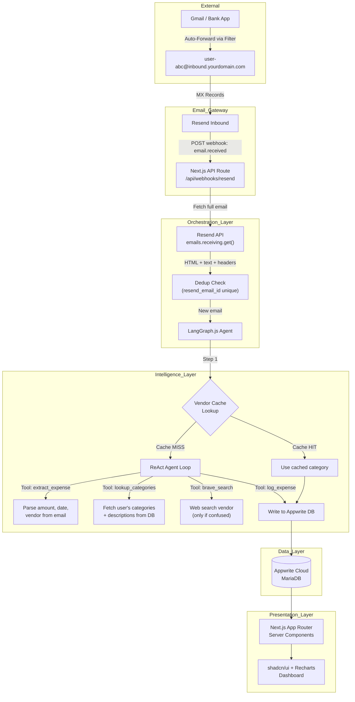
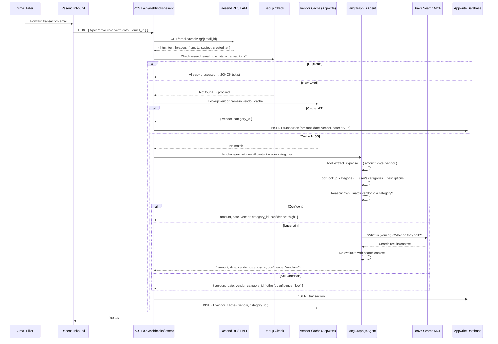
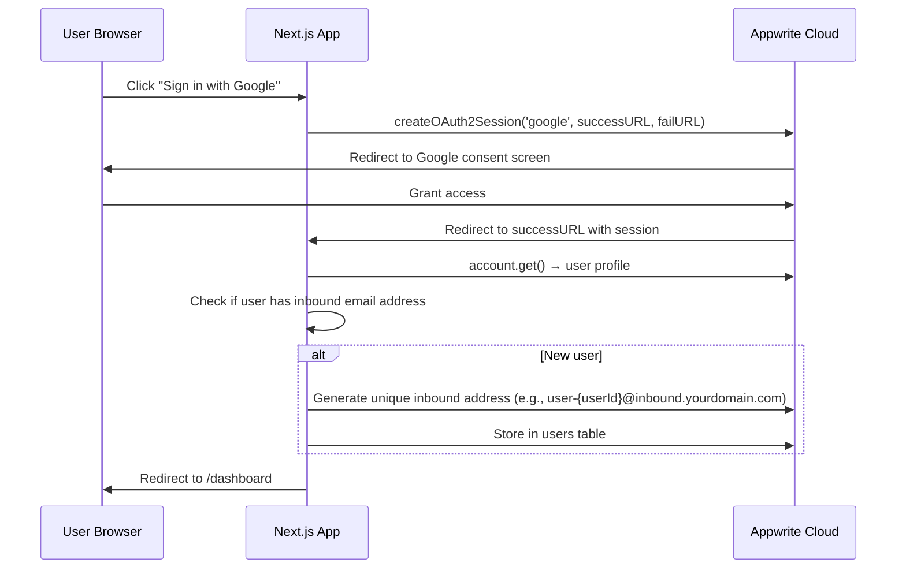

# Aura Expense Agent — Master Architecture Plan

> **Version:** 2.1  
> **Last Updated:** 2026-02-13  
> **Author:** Solutions Architect  
> **Status:** Approved — Ready for Implementation

---

## 📋 Project Overview

Aura is a **"zero-touch" financial intelligence system**. You make a purchase, your bank sends an email alert, and your expense dashboard updates automatically — without you ever opening an app. At its core, Aura is:

1. An **HTTPS server** (Next.js) that receives Resend inbound email webhooks.
2. An **AI agent** (LangGraph.js with ReAct pattern) that extracts, reasons about, and categorizes the expense with near-100% certainty.
3. A **visual dashboard** (React + shadcn/ui + Recharts) that renders budget-vs-actual spending across user-defined time windows.

### 👤 User Stories

| ID    | Story                                                                                                                                 | Acceptance Criteria                                                                                        |
| ----- | ------------------------------------------------------------------------------------------------------------------------------------- | ---------------------------------------------------------------------------------------------------------- |
| US-1  | "As a user, I want my bank transaction emails auto-forwarded to a unique Resend address so I never manually upload a receipt."        | Email arrives → expense logged in < 30s.                                                                   |
| US-2  | "As a user, I want the AI to categorize my expenses with high certainty, learning from my feedback over time."                        | Agent uses cached vendor mapping → Mem0 memory → user categories → web search → `Other` (5-tier fallback). |
| US-3  | "As a user, I want to define monthly budgets per category so I can track how much I've spent vs. my limit."                           | Dashboard shows per-category progress bars + over-budget alerts.                                           |
| US-4  | "As a user, I want to see my spending as pie/donut charts, broken down by category within a selected time range (week, month, year)." | Recharts donut chart + data table with time range selector.                                                |
| US-5  | "As a user, I want to be notified in-app when I'm approaching or exceeding my budget."                                                | Banner at 80% and 100% thresholds per category.                                                            |
| US-6  | "As a user, I want to sign in with Google or GitHub via OAuth2."                                                                      | Appwrite OAuth2 flow for Google + GitHub.                                                                  |
| US-7  | "As a user, I want to manage my expense categories (CRUD) with descriptions that help the AI categorize correctly."                   | Custom categories stored in DB, fed to agent as context.                                                   |
| US-8  | "As a user, I want to correct the AI's categorization by providing conversational feedback."                                          | Feedback sheet → AI proposes new category → user approves/rejects. Max 3 rounds.                           |
| US-9  | "As a user, I want the AI to remember my corrections so it doesn't repeat mistakes."                                                  | Corrections stored in Mem0 → recalled on future categorizations.                                           |
| US-10 | "As a user, I want full CRUD over my transactions (create, update, delete) including manual entry."                                   | Transaction detail sheet + Quick Add form + delete with undo toast.                                        |

---

## 🛠️ The Tech Stack

| Layer                     | Technology                                            | Role                                                                                                 |
| ------------------------- | ----------------------------------------------------- | ---------------------------------------------------------------------------------------------------- |
| **Email Gateway**         | Resend (Inbound)                                      | Receives forwarded emails at a per-user unique address.                                              |
| **Application Server**    | Next.js 19 (App Router + API Routes) using TypeScript | Full-stack: SSR dashboard + webhook handler + API layer.                                             |
| **AI Agent**              | LangGraph.js + LangChain.js + OpenAI GPT-5.1          | ReAct agent with tool use for extraction, categorization, and web search.                            |
| **Agent Memory**          | Vendor Cache table (Appwrite)                         | Cross-invocation memory: maps `vendor → category` to skip re-classification.                         |
| **Agent Feedback Memory** | Mem0 Cloud (`mem0ai` npm)                             | Long-term semantic memory: stores user corrections & preferences for 5-tier categorization.          |
| **Web Search**            | Brave Search MCP Server                               | Fallback tool when the agent can't determine a category from local context.                          |
| **Database**              | Appwrite Cloud (MariaDB)                              | All persistent data: users, transactions, categories, budgets, vendor cache.                         |
| **Authentication**        | Appwrite OAuth2 (Google + GitHub)                     | Zero-password auth with session management.                                                          |
| **UI Framework**          | React 19 + shadcn/ui + Tailwind CSS v4                | Component library with consistent design system.                                                     |
| **Charts**                | Recharts                                              | Donut charts, bar charts, and budget progress visualizations.                                        |
| **Animations**            | Framer Motion                                         | Staggered reveals, count-up numbers, sheet transitions, micro-interactions.                          |
| **Theme**                 | next-themes                                           | Dark/light mode switching via `data-theme` attribute.                                                |
| **Language**              | TypeScript (end-to-end)                               | Type safety across frontend, API, and agent. All imports use `@/` path alias (`"@/*": ["./src/*"]`). |
| **Deployment**            | Vercel                                                | Next.js-native hosting with edge functions and preview deployments.                                  |

### Key Decision Log

| Decision                                        | Rationale                                                                                                                                                                                                                                                                                        |
| ----------------------------------------------- | ------------------------------------------------------------------------------------------------------------------------------------------------------------------------------------------------------------------------------------------------------------------------------------------------ |
| **LangGraph.js over Python LangGraph**          | Avoids cross-language microservice complexity. Entire stack stays TypeScript. Next.js API routes call the agent directly — no HTTP bridge needed.                                                                                                                                                |
| **Appwrite over Supabase**                      | User preference. Appwrite Cloud provides DB, auth (OAuth2), and file storage in one platform.                                                                                                                                                                                                    |
| **Vendor Cache over mem0 (for vendor mapping)** | mem0 adds an external dependency and API cost. A simple Appwrite table (`vendor_cache`) achieves the same "memory" for the specific use case of vendor→category mapping, with zero additional cost.                                                                                              |
| **Mem0 Cloud for feedback memory**              | User corrections need semantic recall ("User prefers X to be in category Y"). Mem0 Cloud provides this with free tier (1,000 memories) and ~200ms latency. Vendor cache handles exact matches; Mem0 handles fuzzy/contextual preferences. See [ADR-015](../ADR/ADR-015-mem0-feedback-memory.md). |
| **Brave Search MCP over Tavily**                | Cheapest web search API. 2,000 free queries/month, then $0.003/query. Sufficient for the low-volume "confused agent" fallback.                                                                                                                                                                   |
| **TypeScript `@/` path aliases**                | All imports use `@/` prefix mapping to `./src/*` via `tsconfig.json` paths. Enforced project-wide for consistency and readability. Example: `import { cn } from '@/lib/utils'`.                                                                                                                  |
| **SGD only (no FX conversion)**                 | V1 simplification. All amounts stored and displayed in SGD.                                                                                                                                                                                                                                      |
| **Recharts over Tremor**                        | shadcn/ui has native Recharts integration via its `chart` component. No extra dependency.                                                                                                                                                                                                        |
| **On-refresh over real-time**                   | V1 simplification. Avoids WebSocket complexity. Appwrite Realtime can be added in V2.                                                                                                                                                                                                            |

---

## 📐 System Architecture



---

## 🔄 Detailed Workflow

### Email-to-Expense Pipeline



### Agent Decision Tree

```
1. EXTRACT: Parse amount (SGD), date, vendor name from email body
2. CACHE CHECK: Is vendor in vendor_cache table?
   ├─ YES → Use cached category → DONE
   └─ NO → Continue to step 3
3. MEMORY CHECK: Query Mem0 for user corrections about this vendor
   ├─ RELEVANT MEMORY → Use remembered preference → DONE
   └─ NO MEMORY → Continue to step 4
4. CATEGORY MATCH: Load user's categories (name + description)
   ├─ HIGH confidence match → Assign category → DONE
   └─ LOW confidence → Continue to step 5
5. WEB SEARCH: Call Brave Search → "What is {vendor_name}?"
   ├─ Search clarifies → Assign category → DONE
   └─ Still ambiguous → Continue to step 6
6. FALLBACK: Assign "Other" category → DONE
7. ALWAYS: Update vendor_cache with the resolved mapping
```

---

## 🔐 Authentication Flow



---

## 📂 Project Structure

```
aura-expense-agent/
├── docs/
│   └── plans/
│       ├── PLAN.md                        ← You are here
│       ├── DATABASE_SCHEMA.md             ← Appwrite collections, attributes, indexes
│       ├── AI_AGENT_ARCHITECTURE.md       ← LangGraph.js agent design
│       ├── API_SPECIFICATION.md           ← All API routes
│       ├── FRONTEND_ARCHITECTURE.md       ← Components, pages, layouts
│       └── TESTING_STRATEGY.md            ← Unit, integration, E2E
├── src/
│   ├── app/                               ← Next.js App Router
│   │   ├── (auth)/
│   │   │   ├── login/page.tsx
│   │   │   └── callback/page.tsx
│   │   ├── (dashboard)/
│   │   │   ├── layout.tsx                 ← Sidebar + nav + budget alerts
│   │   │   ├── page.tsx                   ← Main dashboard (charts)
│   │   │   ├── transactions/page.tsx      ← Transaction history table
│   │   │   ├── categories/page.tsx        ← CRUD categories
│   │   │   ├── budgets/page.tsx           ← Budget management
│   │   │   └── settings/page.tsx          ← Profile + inbound email
│   │   ├── api/
│   │   │   ├── webhooks/
│   │   │   │   └── resend/route.ts        ← Resend webhook handler
│   │   │   ├── transactions/route.ts      ← CRUD transactions
│   │   │   ├── categories/route.ts        ← CRUD categories
│   │   │   ├── budgets/route.ts           ← CRUD budgets
│   │   │   └── feedback/route.ts          ← AI feedback processing
│   │   ├── layout.tsx                     ← Root layout
│   │   └── page.tsx                       ← Landing page
│   ├── components/
│   │   ├── ui/                            ← shadcn/ui components
│   │   ├── charts/
│   │   │   ├── SpendingDonut.tsx
│   │   │   ├── BudgetProgress.tsx
│   │   │   └── CategoryBarChart.tsx
│   │   ├── tables/
│   │   │   └── TransactionTable.tsx
│   │   ├── alerts/
│   │   │   └── BudgetAlertBanner.tsx
│   │   └── layout/
│   │       ├── Sidebar.tsx
│   │       └── Header.tsx
│   ├── lib/
│   │   ├── appwrite/
│   │   │   ├── client.ts                  ← Appwrite client singleton
│   │   │   ├── server.ts                  ← Server-side Appwrite client
│   │   │   └── config.ts                  ← DB IDs, table IDs
│   │   ├── agent/
│   │   │   ├── graph.ts                   ← LangGraph.js agent definition
│   │   │   ├── state.ts                   ← Agent state schema
│   │   │   ├── tools/
│   │   │   │   ├── extract-expense.ts     ← Parse email → structured data
│   │   │   │   ├── lookup-categories.ts   ← Fetch user categories from DB
│   │   │   │   ├── brave-search.ts        ← Web search via Brave MCP
│   │   │   │   └── log-expense.ts         ← Write transaction to DB
│   │   │   └── prompts.ts                 ← System + user prompt templates
│   │   ├── resend/
│   │   │   └── client.ts                  ← Resend SDK singleton
│   │   ├── mem0/
│   │   │   └── client.ts                  ← Mem0 Cloud client singleton
│   │   ├── services/
│   │   │   └── feedback.service.ts        ← AI feedback processing logic
│   │   └── utils/
│   │       ├── date.ts                    ← SGT timezone helpers
│   │       └── currency.ts                ← SGD formatting
│   ├── hooks/
│   │   ├── use-transactions.ts
│   │   ├── use-budgets.ts
│   │   └── use-categories.ts
│   └── types/
│       ├── transaction.ts
│       ├── category.ts
│       ├── budget.ts
│       └── agent.ts
├── scripts/
│   ├── seed-db.ts                         ← Seed test database with mock data
│   ├── setup-appwrite.ts                  ← Create collections, attributes, indexes
│   └── mock-webhook.ts                    ← Simulate Resend webhook payloads
├── __tests__/
│   ├── unit/
│   │   ├── agent/
│   │   ├── api/
│   │   └── utils/
│   ├── integration/
│   │   ├── webhook-pipeline.test.ts
│   │   └── agent-categorization.test.ts
│   └── e2e/
│       └── dashboard.spec.ts
├── .env.local                             ← Environment variables (gitignored)
├── .env.example                           ← Template for env vars
├── next.config.ts
├── tailwind.config.ts
├── tsconfig.json
├── package.json
└── README.md
```

---

## ⚙️ Implementation Phases

### Phase 1: Foundation (Week 1)

- [ ] Initialize Next.js 15 project with App Router, TypeScript, Tailwind CSS v4
- [ ] Install and configure shadcn/ui
- [ ] Set up Appwrite Cloud project: create database, all tables, attributes, indexes
- [ ] Implement Appwrite OAuth2 (Google + GitHub) auth flow
- [ ] Run `scripts/setup-appwrite.ts` to bootstrap the schema
- [ ] Seed default categories for new users

### Phase 2: Email Pipeline (Week 2)

- [ ] Configure Resend inbound domain + MX records
- [ ] Build `POST /api/webhooks/resend` → fetch email → dedup check
- [ ] Implement LangGraph.js agent with ReAct pattern
- [ ] Wire up all 5 agent tools: extract, lookup_categories, recall_memories, brave_search, log_expense
- [ ] Implement Mem0 Cloud integration for feedback memory
- [ ] Implement vendor cache (read-through on agent invocation)
- [ ] Configure Gmail filter + auto-forward for testing

### Phase 3: Dashboard (Week 3)

- [ ] Build dashboard layout with shadcn/ui sidebar
- [ ] Implement spending donut chart (Recharts) with time range selector
- [ ] Build budget management page (per-category CRUD)
- [ ] Build category management page (CRUD with descriptions)
- [ ] Build transactions table with pagination and filters
- [ ] Build transaction detail sheet with full CRUD (edit, delete)
- [ ] Build Quick Add sheet for manual transaction entry
- [ ] Implement AI feedback flow (feedback sheet + conversational correction)
- [ ] Implement budget alert banner (80% warning, 100% over-budget)

### Phase 4: Polish & Testing (Week 4)

- [ ] Unit tests for agent tools, date utils, API routes
- [ ] Integration tests for full webhook→agent→DB pipeline
- [ ] E2E tests with Playwright for dashboard flows
- [ ] Seed script for test database with mock data
- [ ] Error handling, loading states, empty states
- [ ] Deploy to Vercel

---

## 📖 Companion Documents

### Architecture & Design

| Document                                                   | Description                                                                                                                               |
| ---------------------------------------------------------- | ----------------------------------------------------------------------------------------------------------------------------------------- |
| [DATABASE_SCHEMA.md](./DATABASE_SCHEMA.md)                 | Complete Appwrite database schema: all tables, attributes, indexes, relationships, seed scripts.                                          |
| [AI_AGENT_ARCHITECTURE.md](./AI_AGENT_ARCHITECTURE.md)     | LangGraph.js agent design: state machine, tools, ReAct loop, Brave Search via Smithery.ai MCP, vendor cache strategy.                     |
| [API_SPECIFICATION.md](./API_SPECIFICATION.md)             | All Next.js API routes: webhook handler, CRUD endpoints, request/response schemas.                                                        |
| [FRONTEND_ARCHITECTURE.md](./FRONTEND_ARCHITECTURE.md)     | Component tree, page layouts, shadcn/ui + Recharts integration, budget alerts, responsive design.                                         |
| [BACKEND_DESIGN_PATTERNS.md](./BACKEND_DESIGN_PATTERNS.md) | SOLID principles, Repository, Service, Factory, Strategy, DI patterns with full code examples.                                            |
| [UX_DECISIONS.md](./UX_DECISIONS.md)                       | User personas, core flows, budget salary allocation UX, AI feedback correction flow, empty states, responsive breakpoints, accessibility. |
| [DESIGN.md](./DESIGN.md)                                   | "Aurora Noir" design system: typography, color palette, spacing, motion, dark/light mode, component styling, anti-patterns.               |

### Decision Records

| Document                      | Description                                                                           |
| ----------------------------- | ------------------------------------------------------------------------------------- |
| [ADR Index](../ADR/README.md) | 15 Architecture Decision Records covering every technology and design pattern choice. |

### Testing

| Document                                        | Description                                                                                       |
| ----------------------------------------------- | ------------------------------------------------------------------------------------------------- |
| [Testing Strategy](./TESTING_STRATEGY.md)       | Original high-level testing strategy.                                                             |
| [Testing Plan (TDD)](../testing-plan/README.md) | Master TDD testing plan with 6 detailed test plans, JSON fixtures, CI pipeline, coverage targets. |

### Feature Specs

| Document                               | Description                                                                                         |
| -------------------------------------- | --------------------------------------------------------------------------------------------------- |
| [Feature Index](../features/README.md) | 13 JIRA-style feature specs (FEAT-001 to FEAT-013) with acceptance criteria and Definition of Done. |

---

## 🚨 Risks & Mitigations

| Risk                                        | Impact                              | Mitigation                                                                                                   |
| ------------------------------------------- | ----------------------------------- | ------------------------------------------------------------------------------------------------------------ |
| **LangGraph.js is less mature than Python** | Agent bugs, missing features        | Pin to stable version. Keep agent logic simple (5 tools). Fallback to direct OpenAI call if LangGraph fails. |
| **Resend webhook delivery failure**         | Missed transactions                 | Resend has built-in retry (up to 3 attempts). Dedup by `resend_email_id` handles replays safely.             |
| **Appwrite Cloud rate limits**              | Throttled DB writes                 | Low volume (< 50 tx/day). Well within free tier limits.                                                      |
| **Email format variance**                   | Extraction failures                 | Agent handles both plain-text bank alerts and rich HTML receipts. Fallback: log raw email for manual review. |
| **Brave Search API downtime**               | Agent can't resolve unknown vendors | Agent still categorizes using local context. Web search is a "nice-to-have" fallback, not a hard dependency. |

---

## 🔮 V2 Roadmap (Out of Scope for V1)

- **Multi-currency support** with live FX conversion
- **Appwrite Realtime** for live dashboard updates
- **Multi-user** with unique Resend inbound addresses per user
- **Receipt OCR** for image-based receipts (Appwrite Storage + GPT-4o Vision)
- **Export to CSV/PDF** for monthly spending reports
- **Mobile-responsive PWA**
- **Recurring expense detection** (auto-tag subscriptions)
- **Mem0 local search consolidation** — periodic memory compaction and pattern extraction
